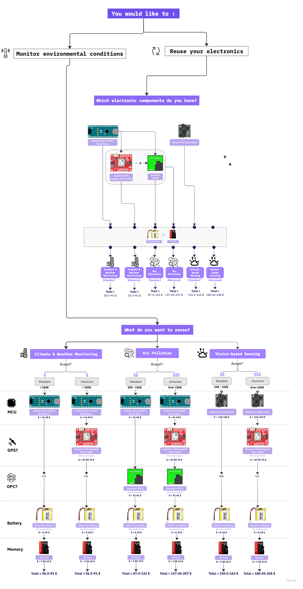

# 🏁 Getting Started

---

This is a guide to help you select the correct Octopus for your use case.

---

## Choose your Octopus

To build the octopus, you need to build and develop three parts: the bodyframe, the hardware, and decide on a use case for the software to flash to your device. Below, you can find a flowchart helping you to decide which components you need to build your octopus based on what you want to sense. 

## Quickstart

Below, we provide you the full list of physical components that are compatible with the octopus. 

:::info

Note that all links provided are examples we know will work to build the octopus, but it does not exclude other providers of manufacturers.

:::

### Components to order

Overview of all hardware components possible to add to the octopus: 

| **Sensor** | **Comment** | **Link** |
|-----------------|-----------------|-----------------|
| Arduino Nano 33 BLE Sense Rev 2 | ... | ... |
| Arduino Nicla Vision | ... | ... |
| SPS30 | ... | ...|
| GPS Antenna | ... | ... |
| Lithium Battery | ... | ... |
| SD Card | ... | ... |

Components you need to order to build the body frame: 

| **Bodyframe** | **Comment** | **Link** |
|-----------------|-----------------|-----------------|
| Filament | For 3D printing the octopus, make sure the filament you order works with your printer! | [Purple Glow PLA](https://www.amazon.com/Printer-Filament-1-75mm-Purple-Printing/dp/B0C1NL5QS3/ref=sr_1_7_sspa?crid=35JVUOTCE04W1&dib=eyJ2IjoiMSJ9.jdCkb-i3UcUn2IRb378sRHUjCPxJsI2PQI7ChImzk36x-0AGvOxX3fw7uRLTr0aOMgm4hCMpd_5HWtjmKkEjyEl4Y2fHrMYZusbnXhVx8eljjMz5Bnk8FRbjJIj2QauCF3-jkoxlfYB5CjHef_Yi-M0G9CorJjv3z4ofXKTImTEwa0Xh0_dRCl2cemslDbxKiCNKabyUYq1kLzDJsx7VQf2qFDO-hdTC_B7mKYL9dGQ.IOQuryL1CDaERoPEz2sSp299Ft9ADDV9ZVm1TP9kfuU&dib_tag=se&keywords=PLA%2BPro%2Bglow%2Bin%2Bthe%2Bdark&qid=1715085309&sprefix=pla%2Bpro%2Bglow%2Bin%2Bthe%2Bdar%2Caps%2C118&sr=8-7-spons&sp_csd=d2lkZ2V0TmFtZT1zcF9tdGY&th=1) |
| Silicone | For the octopus legs | [Dragon Skin 30 Mold Making Silicone Rubber  or Smooth-On Ecoflex 00-50 Platinum Silicone](https://www.amazon.com/Smooth-Ecoflex-00-50-Platinum-Silicone/dp/B00GJ80HIC/ref=sr_1_4_sspa?crid=G0FYRJRDGMF8&dib=eyJ2IjoiMSJ9.tfqGTyE5PILFlb1RRTd7XypT87sW1sqeeJcCqLWVeb-61JzlrJidup6ooqkPiVcDshxgdNNfUyMTIFBgX37ZeTNMBYJgXKLTE5xC1q37JWA.sBytAkl3dj6y2-VaTqx7u7TgnRUuQxoTxTFpN3HxCzM&dib_tag=se&keywords=Smooth-On+Ecoflex+00-50+Platinum+Silicone&qid=1715021991&sprefix=smooth-on+ecoflex+00-50+platinum+silicone%2Caps%2C87&sr=8-4-spons&sp_csd=d2lkZ2V0TmFtZT1zcF9hdGY&psc=1) |
| Magnets | For making the octopus legs magnetic | [10mm diameter x 5mm thick N52 Neodymium Magnet](https://www.amazon.com/Hyoocct-Kitchen-Refrigerator-Magnets-Whiteboard/dp/B0C9JRHP8B/ref=sr_1_4?crid=2H4HVEH11FVWY&dib=eyJ2IjoiMSJ9.GlRW0OVV1rvf0l8j65yEG3vAy8RmqkLBddEdTqljHAWF6Ans0gqJos1YWf7ahKvvVpU7tPXTAb9WCKcttusNoNyPK_9acZYcB1TwAz8mHp_gDpTAnoyEH2a4W-6lbFuBJm5aulsk6MEQrCA5ql2fDEkbf---BZJBhAdxGKKfckgOyJnJZlFnzt-lZ6S_6UkFRlYCU9EUQMLuGsZjt-8rTh6TwBH16Bl7gfrnGICZxGU.O8sd83h-OadGoyPCNS3M0Qiess5G69DD3VnvTmUQP7M&dib_tag=se&keywords=n52+magnets+10+5&qid=1715024651&sprefix=n52+magnets+10+5%2Caps%2C98&sr=8-4) |
| Wire | For making the octopus legs wrap around objects. | [Galvanized Binding Wire](https://www.amazon.com/dp/B091SS9GQG/ref=sspa_dk_detail_4?psc=1&pd_rd_i=B091SS9GQG&pd_rd_w=VLvq5&content-id=amzn1.sym.d81b167d-1f9e-48b6-87d8-8aa5e473ea8c&pf_rd_p=d81b167d-1f9e-48b6-87d8-8aa5e473ea8c&pf_rd_r=BVZQT6NCS2XZM16EC631&pd_rd_wg=6S3UB&pd_rd_r=9745bc62-5364-46ee-835e-c74d40d950d1&s=hi&sp_csd=d2lkZ2V0TmFtZT1zcF9kZXRhaWxfdGhlbWF0aWM). Between 20 - 16 Gauge works best. | 
| Small Spring Clamps | For keeping the two mold parts together while making the octopus legs. | [Small Spring Clamps](https://www.amazon.com/Professional-Plastic-Backdrop-Photography-Improvement/dp/B08RXW32H4/ref=sr_1_4_sspa?crid=1J8SAX23LM8RL&dib=eyJ2IjoiMSJ9.bBQ1vi53Rm3_FWheH6Y-5UkGls3nde3m93OtWibJOJ_FNvoDQNWibBhXN57Ci-nxlCZ1mR9umqcrw_yAq3a8z3mrO-G19y8otVJjrQROz6gvkCsMKingTqyxJs4CXEZcg1kKhUez3hpgpsEqO4KFLAJ7Er0R8gjkVuY5O3Aw2b1jUy_BlnSP0j2yLhqu5CNi5kXZdNDo9dloSJA4q6uPs7H3HRNrQataPaMg0sqF3fvUxnvJtQbb9UuLeILQRI4E1dudFftenBUe5R9V5xm18zeDSasvQjGafeHC3fOgoqY.wVwtEicvwd-w6DT0kaTemHq8ntETuhty11PaVQpvF0k&dib_tag=se&keywords=Small+Spring+Clamps&qid=1715024759&sprefix=small+spring+clamps%2Caps%2C95&sr=8-4-spons&sp_csd=d2lkZ2V0TmFtZT1zcF9hdGY&psc=1) | 

Tools for soldering the Hardware (if you decide to solder yourself):

| **Tools** | **Comment** | **Link**|
|-----------------|-----------------|-----------------|
| Soldering iron | | |
| Soldering paste | | |

Assuming you are soldering an octopus will all parts included, this will be your list of hardware components to solder: 

| **Hardware** | **Comment** | **Link** |
|-----------------|-----------------|-----------------|
| ... | ... | ...|

