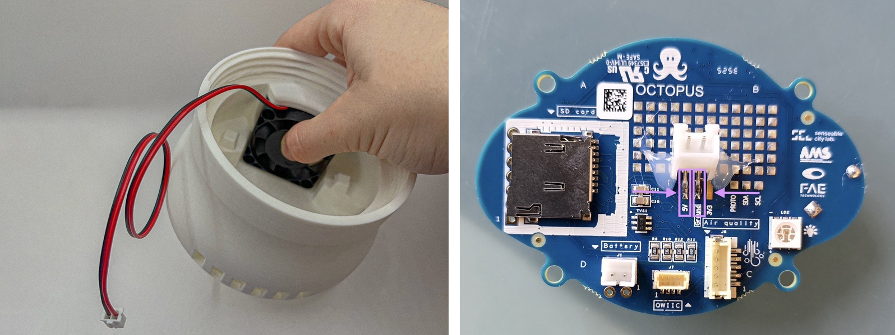

# 🧩 Assembly

---

## Overview

This guide explains how to assemble the Octopus across its **four main configurations**:

1. **Static Standard**: fixed deployments (e.g., air temperature sensing)
2. **Mobile Standard**: adds GPS for mobile deployments
3. **Extended**: adds air quality sensing (SPS30)
4. **Vision**: uses Nicla Vision for camera-based applications

Estimated assembly time: **~20 minutes**

---

## 1. Static Standard Configuration  
*(Base setup – required for all other configurations)*

### Step 1: Prepare Bottom Layer

Place the **battery** into the bottom section. Secure the battery using **rubber bands** around the built-in posts to prevent movement.

 
### Step 2: Prepare Top Layer
Insert a **micro SD card** into the PCB designated slot. Connect the battery's plug to the PCB at the **port labeled “battery”**. 

### Step 3: Mount the **Arduino** into the PCB.  

⚠️ **Important orientation rule:**  
The USB-C connector should point in the opposite direction of the supercapacitor (yellow circular component).  
***Incorrect placement will prevent the device from powering on.***

 

### Step 4: Place the PCB into the enclosure 
Secure it with **elastic bands**. Turn on the board using the **white onboard button** (pink arrow)

 

### Step 5: Fan placement
The **fan is required** for reliable operation in real-world deployments and to maintain proper airflow.

Insert the fan into the head enclosure, ensuring the **blades face inward**. Connect the fan cable to the 5V/GND port on the PCB

### Step 6: Final Assembly

Attach the top and bottom enclosure sections by screwing them together.  

 

:::tip
Ensure the wires are long enough to twist comfortably during this step.
:::

### Optional Mounting

**Install a 1/4"-20 threaded insert:**

**1.** Flip the bottom enclosure upside down  
**2.** Place the insert in the designated hole  
**3.** Use a **soldering iron** to press it into place  

:::warning
Keep the soldering iron at a **90° angle**. Do not tilt the insert.
Remove the iron immediately after insertion to avoid damaging the print.
:::

---
## 2. Mobile Standard Configuration  
*(Adds GPS to Static Standard)*

Follow all steps from **Static Standard**

### Additional Steps

Place the **GPS module** on top of the battery in its designated slot in the bottom enclosure, and secure it with **elastic bands**

 

Connect the GPS module to the PCB via the **QWIIC port**.

---

## 3. Extended Configuration  
*(Adds air quality sensing – SPS30)*

Build on **Mobile Standard**

### Step 1: Prepare Middle Layer

Insert the **SPS30 air quality sensor** into the middle enclosure.

### Step 2: Connect Sensor

Plug the SPS30 into the **“air quality” port** on the PCB.

### Step 3: Final Assembly

Attach the middle section to the bottom section.  

:::tip
Hold wires while passing them through the middle section openings to prevent damage.
:::

 

Attach the head section to complete the assembly.  

---

## 4. Vision Configuration  
*(Camera-based sensing with Nicla Vision)*

Build on **Mobile Standard**, but swap the Nano 33 BLE Sense for the **Arduino Nicla Vision** for image-based applications. 

Camera must be **centered on the PCB** and aligned with the enclosure opening.

---

**Your Octopus is now assembled! You’re ready to move on to setting up the Octopus Library.** 
<!--  -->
