# 🧩 Assembly

---

## Overview

This guide explains how to assemble the Octopus across its **four main configurations**:

1. **Static Standard**: fixed deployments (e.g., air temperature sensing)
2. **Mobile Standard**: adds GPS for mobile deployments
3. **Extended**: adds air quality sensing (SPS30)
4. **Vision**: uses Nicla Vision for camera-based applications

Estimated assembly time: **~20 minutes**

---

## 1. Static Standard Configuration  
*(Base setup – required for all other configurations)*

### Step 1: Prepare Bottom Layer

Place the **battery** into the bottom section. Secure the battery using **rubber bands** around the built-in posts to prevent movement.
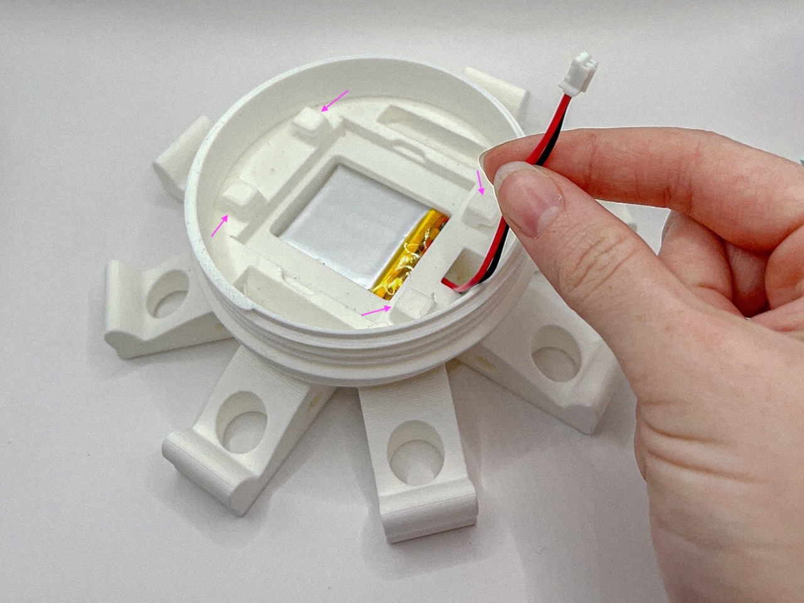

 
### Step 2: Prepare Top Layer
Insert an **SD card** into the PCB designated slot. Connect the battery's plug to the PCB at the **port labeled “battery”**. 
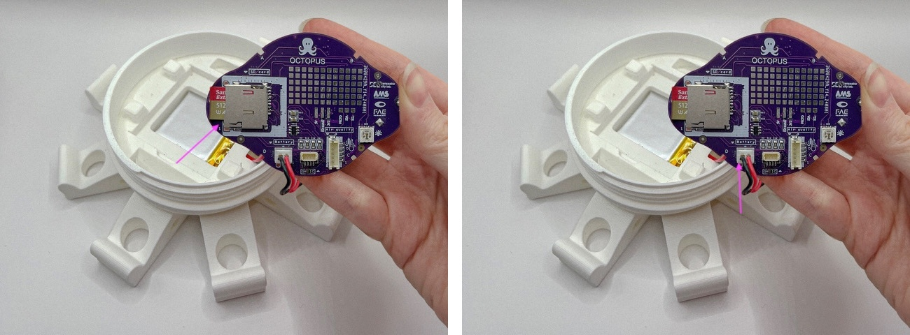

Mount the **Arduino Nano 33 BLE Sense** on the PCB.  

:::info
⚠️ **Important orientation rule:**  
The USB-C connector should point in the opposite direction of the supercapacitor (yellow circular component).  
***Incorrect placement will prevent the device from powering on.***
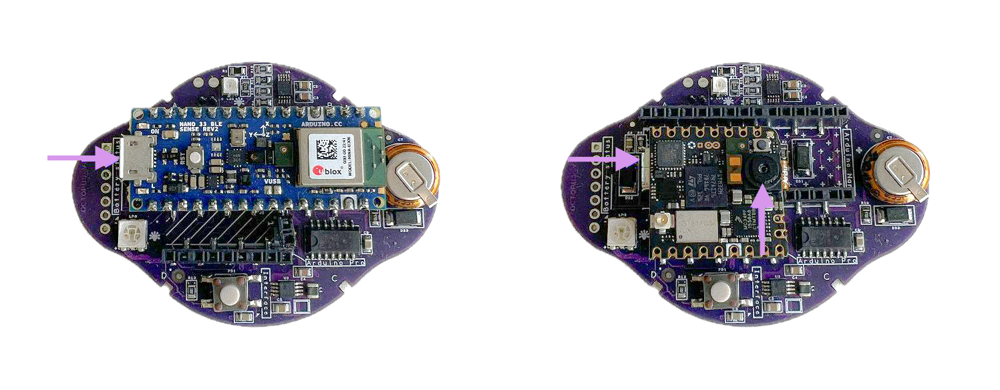
:::
 

**4.** Turn on the board using the **white onboard button**.

 

**5.** Place the PCB into the enclosure and secure it using **rubber bands**.

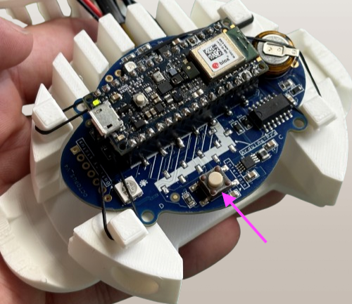

 

### Step 3: Cooling (mandatory)

:::info
⚠️ The **cooling fan is required** for reliable operation in real-world deployments.
:::

**1.** Insert the fan into the head enclosure.  Ensure that the orientation is so that the **blades are facing inward**. 

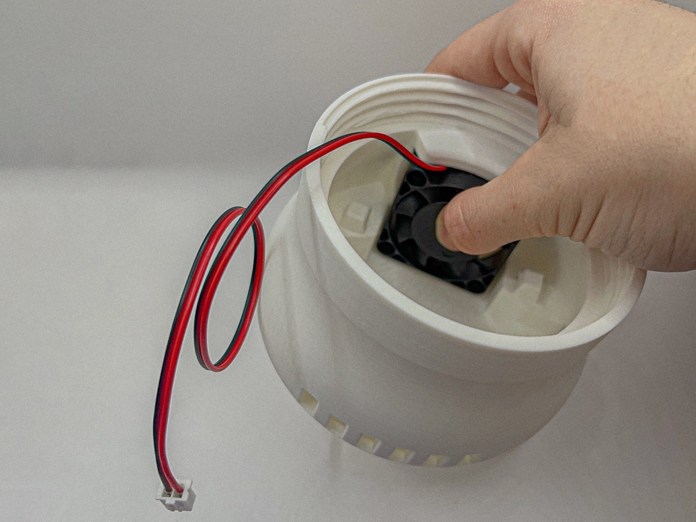

 

**2.** Connect the fan:

- Option A: Use a **2-pin header (5V + GND)**  
- Option B: Solder directly:  
  - **Red → 5V**  
  - **Black → GND**

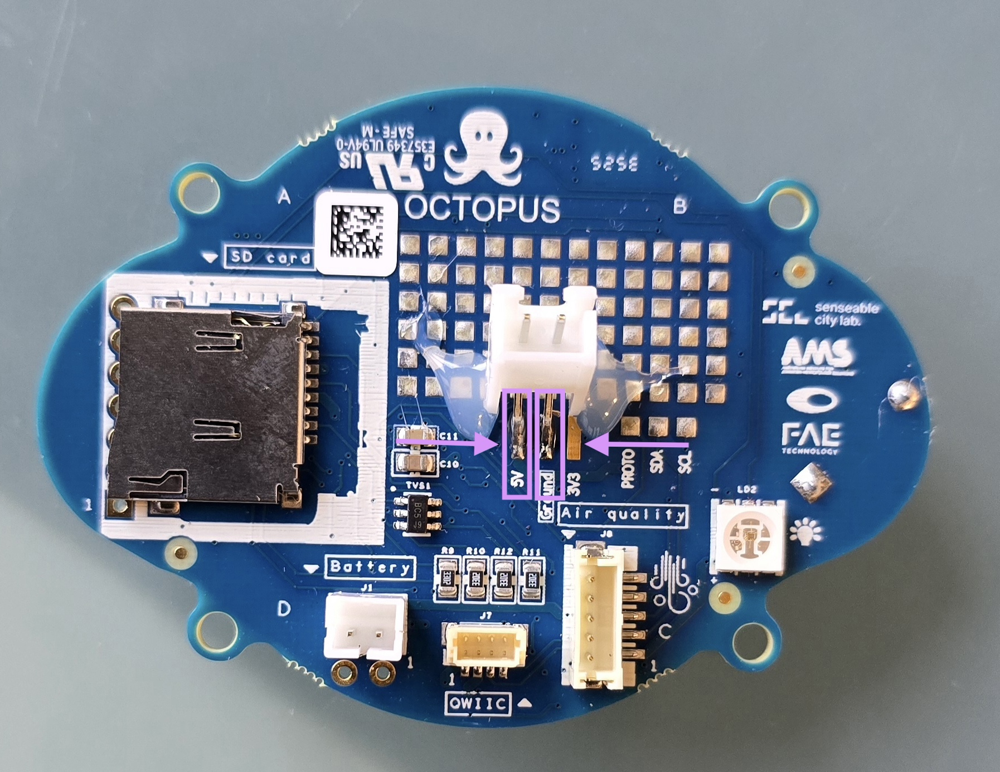

### Step 4: Final Assembly

**1.**  Press the octopus cap on the top body of the device until you hear a click.

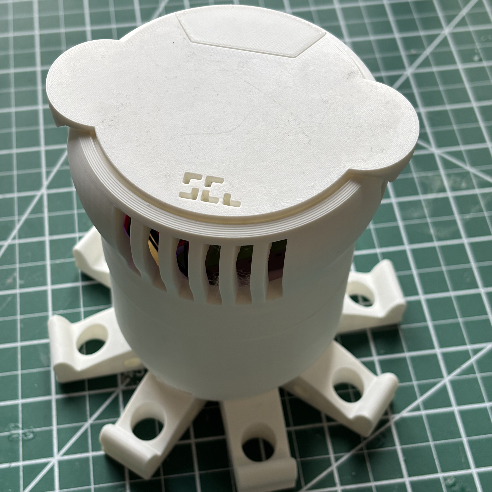

**2.**  Attach the top and bottom enclosure sections by screwing them together.  

 

:::tip
Ensure the wires are long enough to twist comfortably during this step.
:::

### Optional Mounting

**Install a 1/4"-20 threaded insert:**

**1.** Flip the bottom enclosure upside down  
**2.** Place the insert in the designated hole  
**3.** Use a **soldering iron** to press it into place  

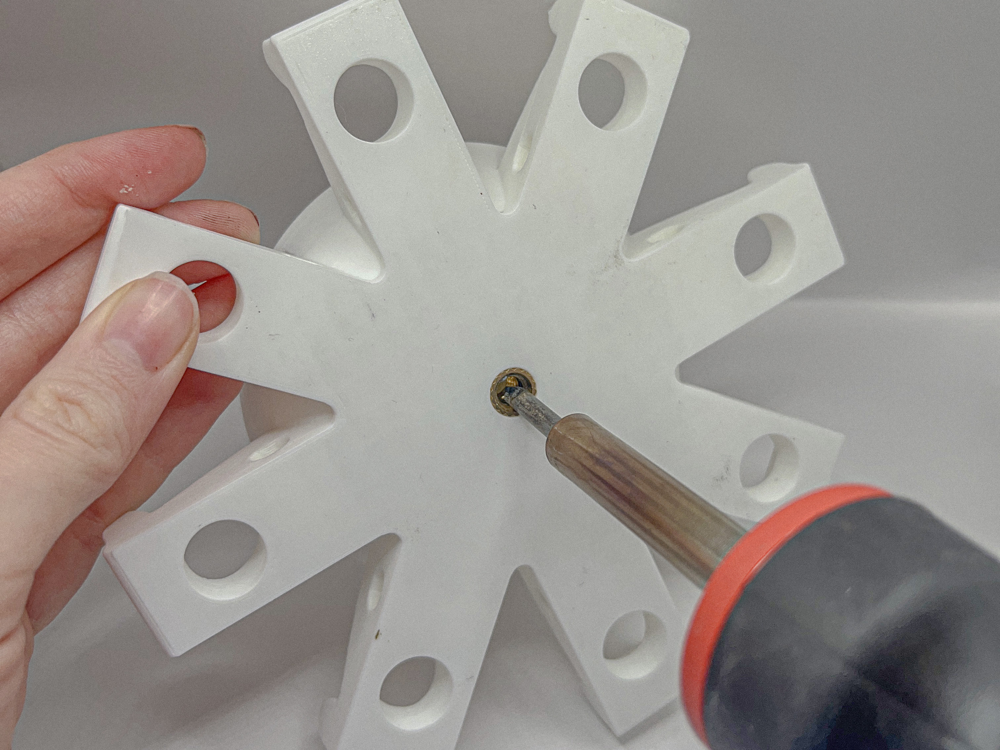

:::warning
Keep the soldering iron at a **90° angle**. Do not tilt the insert.
Remove the iron immediately after insertion to avoid damaging the print.
:::

---
## 2. Mobile Standard Configuration  
*(Adds GPS to Static Standard)*

Follow all steps from **Static Standard**, then:

### Additional Steps

**1.** Place the **GPS module** on top of the battery.  

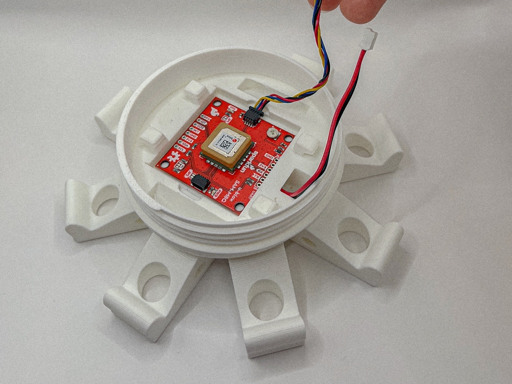

 

**2.** Secure it using **rubber bands**.

 

**3.** Connect the GPS module to the PCB via the **QWIIC port**.

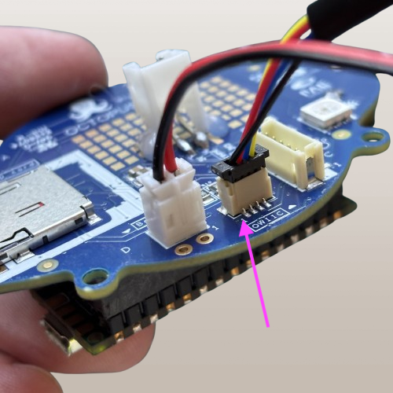

---

## 3. Extended Configuration  
*(Adds air quality sensing – SPS30)*

Build on **Mobile Standard**, then:

### Step 1: Prepare Middle Layer

**1.** Insert the **SPS30 air quality sensor** into the middle enclosure.

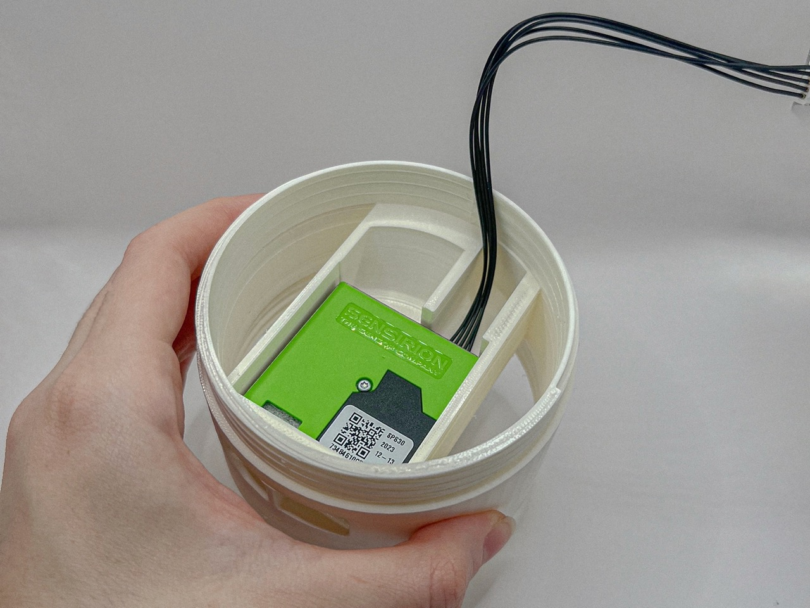

:::info
Ensure correct orientation of the SPS30. Make sure that: 
1. The logo is facing upward 
2. The inlet and outlet are aligned with the printed enclosure openings
:::

### Step 2: Connect Sensor

**1.** Plug the SPS30 into the **“air quality” port** on the PCB.

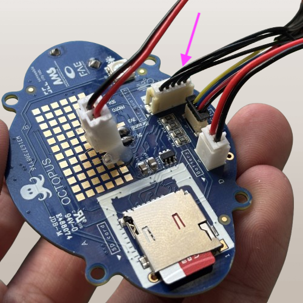

### Step 3: Final Assembly

**1.** Attach the middle section to the bottom section.  

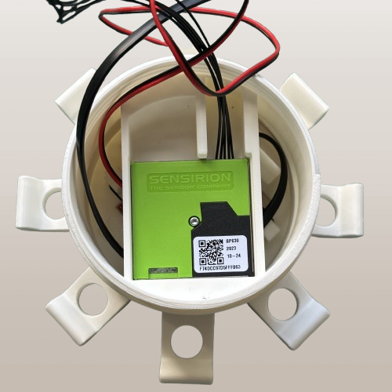

:::tip
Hold wires while passing them through the middle section openings to prevent damage.
:::

 

**2.** Attach the head section to complete the assembly.  

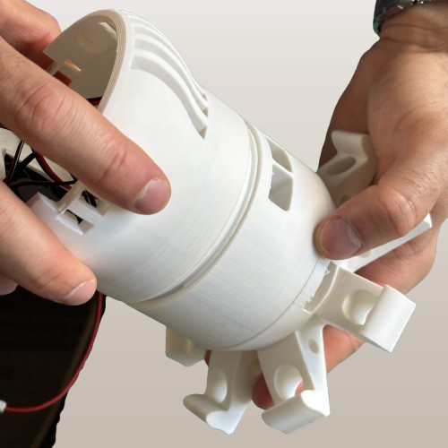

---

## 4. Vision Configuration  
*(Camera-based sensing with Nicla Vision)*

Build on **Mobile Standard**, but replace the microcontroller:

### Key Differences

**1.** Use **Arduino Nicla Vision** instead of Nano  

**2.** Ensure correct placement:
- Camera must be **centered on the PCB**
- Camera aligned with enclosure opening  

**3.** Turn on using onboard button  

---

**Your Octopus is now assembled! You’re ready to move on to setting up the Octopus Library.** 
<!--  -->
