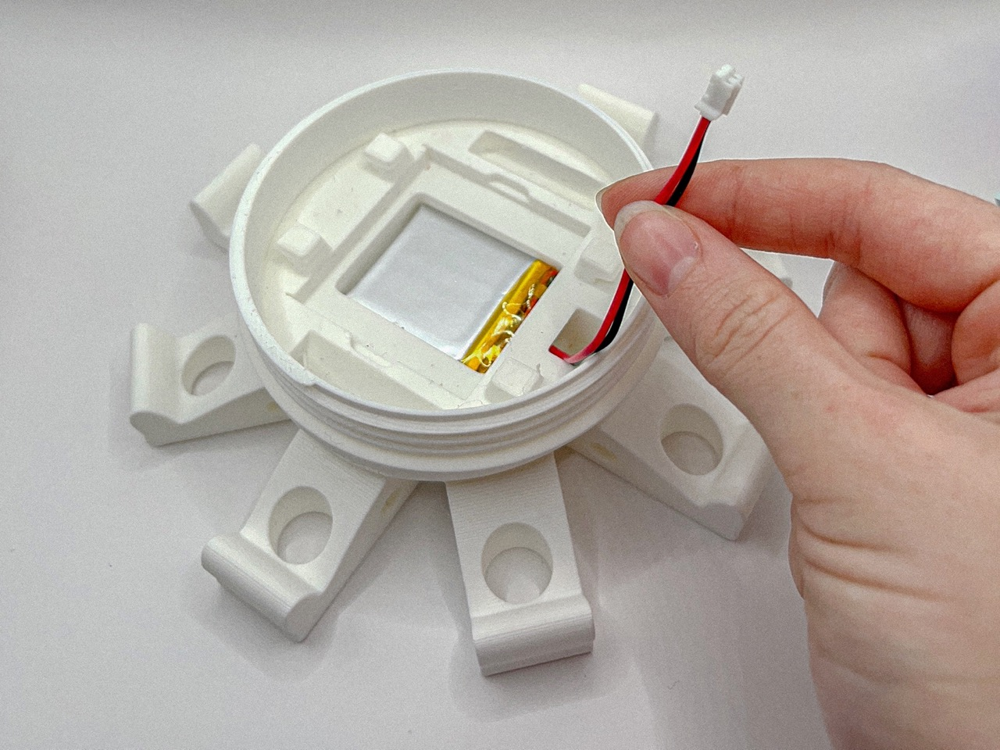

# 🧩 Assembly

This section looks into how to assemble your own Octopus. 

---

## Overview

This guide will help you assemble your own Octopus based on the configuration you’ve chosen. This process should take you about **20 minutes**.  
It is divided into two parts accordingly:
1. **Small octopus (standard configuration)**  : For use cases like **air temperature monitoring** or **flower classification**. This configuration is also available with an **integrated fan** that could be useful in warmer climates. *(instructions can be found at the very end of this guide)*
2. **Long octopus (expanded configuration)**  : For **air quality monitoring** with additional components.

## Standard Configuration (Air Temperature and Flower Classification)

### Step 1: Prepare the bottom layer

**1.** Place the **battery** into the bottom section.   

  
**2.** Position the **GPS module** on top of the battery in the designated slot.  

  
**3.** Secure both the battery and GPS module using **rubber bands** around the protruding securing parts.  

 
  

### Step 2: Prepare the top layer

**1.** Insert an **SD card** into the PCB designated slot for data storage.
 

**2.** Pick up the PCB and plug the battery into the **port labeled “battery”** on its back. 
 

  
**3.** After selecting the appropriate head variation for the given arduino *(Nikla vision for camera use, Nano for temperature and air quality)*, **turn on** the Arduino board by pressing the white button as shown in the picture.
 

  
**5.** Securely place the Arduino board in the print, making sure it is properly oriented as per the following image.
 

  
**6.** Securely attach the PCB to the part using **rubber bands**, ensuring they are wrapped tightly around the protruding sections for a stable hold.
 

 

### Step 3: Plug electronics

**1.** Connect the GPS module to the PCB at the **“QWIIC” port**.
 

 

### Step 4: Final assembly

**1.** Attach the bottom part to the head section by screwing them together.
 

:::tip

Ensure the wires are long enough to twist comfortably during this step.
:::

  
---

## Optional / Expanded Configuration (Air Quality Monitoring)

This version includes the **middle section** for housing the Sensirion SPS30 sensor.

### Step 1: Prepare the middle layer

Insert the **Sensirion SPS30 sensor** into the middle section and ensure it is placed in its correct orientation.
 

:::info

When mounting the Sensirion SPS30 sensor, ensure the **top side with the logo and connection pins is visible**, with the smaller hole (air inlet) and the larger hole (air outlet) facing outward **towards the part openings**.
:::

 

### Step 2: Connect electronics

 Plug the Sensirion SPS30 sensor into the **“air quality” port** on the PCB.
 

 

### Step 3: Integration into final octopus assembly

**1.** Attach the middle section to the bottom section, ensuring wires pass through the ventilation cores.
 

:::tip

Hold onto the wires as they pass through the ventilation cores and during the twisting process to ensure they don’t get caught between the layers.
::: 
  

**2.** Screw the head section onto the middle section after inserting all required wires to the PCB - as per previous instructions.
 

  
---

## Optional / Integrated Fan Configuration 

For applications in warmer climates where overheating might occur, an **integrated cooling fan can be added to the head section**. Please refer to the mechanics file section to print the appropriate part before moving forward down the assembly guide. 

### Additional Steps

**1.** Place the fan in the head layer with the **blades facing the interior of the print**. Push it into position from its center until secure.
 

:::tip

To safely secure the fan into position, push it from its center until you hear a *'click'* sound. 
:::

  
**2.** Solder a **2-pin right-angle male pin header** to the **'GROUND' solder pad** and the **'5V' pad**  - as shown below.  
 

:::tip

Alternatively, if you don't have pin headers in hand, you can also cut the fan wires, solder the **black wire of the fan to the 'GROUND' solder pad** and the **red wire to the '5V' pad**. 
:::
 
**3.** Repeat the steps above to plug the battery and the GPS to the PCB.  
 

---

**With your Octopus fully assembled, you’re now ready to dive into the next step: setting up the Octopus firmware!** 
<!--  -->
