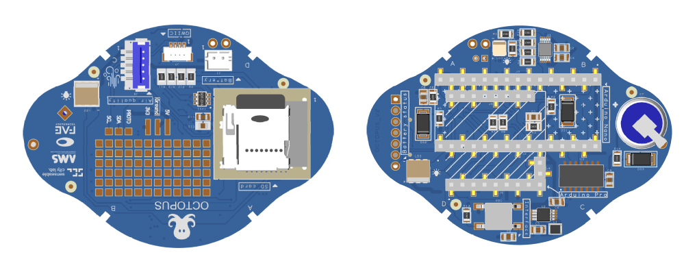

# ⚡ PCB

_Octopus electronics_

---

# PCB 
*Printed circuit board*

 
The costum PCB can be set up to ways: 
1. Order the board from a manufacturing company and ask them to pre-solder the components for you. 
2. Order the board and all small hardware components separately, and solder it by hand. *Note, this requires you to know how to solder small components.*

### Process

Possible companies to order from: https://jlcpcb.com/ or https://www.pcbway.com/

1. On JLCPB if the plan is to do PCBA (to assemble the components as well), better to do the instant quote https://cart.jlcpcb.com/quote
2. Select the standard PCB/PCBA - By selecting PCB Assembly at the end of the quote you indicate a pre-soldered device.
3. Add upload the gerber file (from the githhub link below)

### Files

Gerberfiles, schematics and BOM can be found in the github repository here: 
https://github.com/MIT-Senseable-City-Lab/octopus-fabrication/tree/main/hardware

