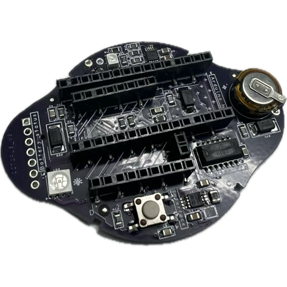
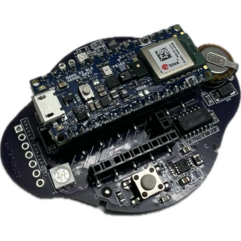
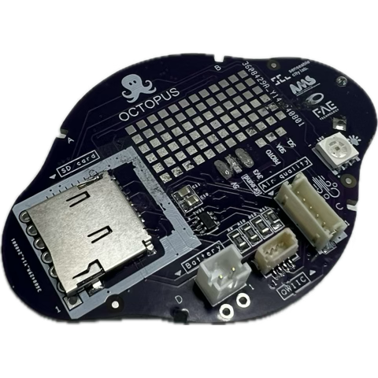

# ⚡ Electronics (files)

_Octopus electronics_

---

# PCB

# Harnesses

*add image of cables*

# Files

schematics

KiCad file with embedded component libraries

gerbers and centroid files

buy electronics from turnkey services: pcbway, jlcpcb