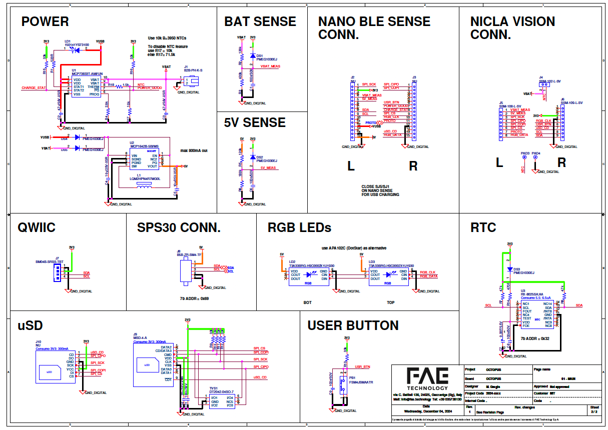

# ⚡ PCB

---

# PCB 
*Printed circuit board*

 
The costum PCB can be set up to ways: 
1. Order the board from a manufacturing company and ask them to pre-solder the components for you. 
2. Order the board and all small hardware components separately, and solder it by hand. *Note, this requires you to know how to solder small components.*

## Schematics

[🔎 see larger](https://github.com/MIT-Senseable-City-Lab/octopus-fabrication/blob/main/hardware/octopus_schematic.pdf)

### Process

Possible companies to order from: https://jlcpcb.com/ or https://www.pcbway.com/

1. On JLCPB if the plan is to do PCBA (to assemble the components as well), better to do the instant quote https://cart.jlcpcb.com/quote
2. Select the standard PCB/PCBA - By selecting PCB Assembly at the end of the quote you indicate a pre-soldered device.
3. Add upload the gerber file (from the githhub link below)

### Files

Gerber files and schematics can be found in the [Github repository](https://github.com/MIT-Senseable-City-Lab/octopus-fabrication/tree/main/hardware)

## Schematics

[🔎 see larger](https://github.com/MIT-Senseable-City-Lab/octopus-fabrication/blob/main/hardware/octopus_schematic.pdf)

## Specs
- **BOARD SIZE (XxYxZ):** 69.951x50.268x1.6mm
- **IPC-6012 - IPC-A-600:** CLASS 2
- **BOARD TOLERANCE (X|Y|Z):** +/-0.2 | +/-0.2 | +/-10%
- **E-TESTING:** YES
- **NO.OF LAYERS:** 4
- **UL-WARKING:** YES
- **BASE COPPER OUTSIDE:** 18um
- **MICROVIA (hole < 100um):** NO
- **BASE COPPER INSIDE:** 35um
- **BLIND VIA:** NO
- **FINISH:** ENIG
- **BURIED VIA:** NO
- **SOLDER COLOR:** BLUE
- **VIA FILL/VIA IN PAD:** NO
- **SILKSGREEN COLOR:** WHITE
- **MIN. VIA SIZE:** 0.254mm
- **DIELECTRIC MATERIAL:** FR4-TG150
- **MIN.TRACE SPACING:** 0.2mm
- **IMPEDANCE CONTROL:** NO
- **QUIER LAYER MIN.TRACE WIDTH:** 0.2mm
- **CTI:** 175V
- **INNER LAYER MIN.TRACE WIDTH:** 0.2mm

