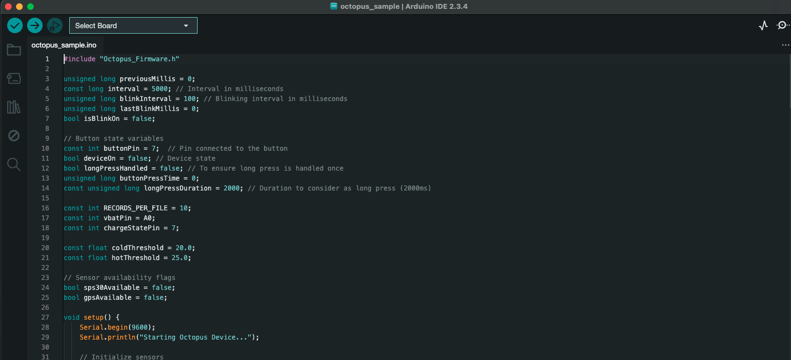

# 👋 Hello Octopus!

---

This guide will show you how to upload your first octopus file and check that everything is set up correctly! 

The example is using an Octopus with the Arduino Nano Board.

**Upload the program**

*Assuming you have the file octopus_sample.ino from the Example folder in the Octopus Firmware*

The first thing you need to do is to compile the file by clicking on the checkmark up to the left. 

Now, just click the "Upload" button in the environment (the arrow next to the checkmark), and allow a few seconds for the process - you should observe the orange LED on the board gradually pulsing in and out. Upon successful upload, you will see the message "Done uploading." displayed in the status bar.

_Please note: If the board fails to enter upload mode, perform a double press on the reset button before initiating the upload process. This action should prompt the orange LED to pulse, indicating that the board is ready for upload._

After a few seconds, you should see the LED on the octopus light up purple. If that is the case, good work! Everything is correctly set up! If not, try toubleshooting suggestions from the [arduino help center](https://support.arduino.cc/hc/en-us).

---
