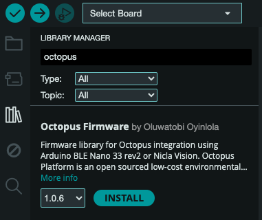
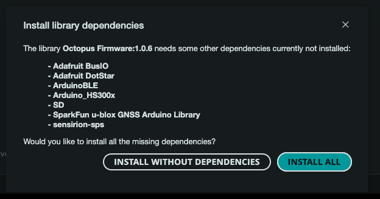
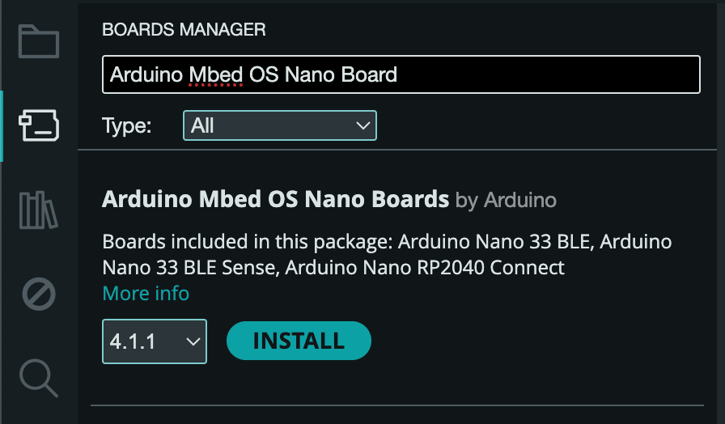
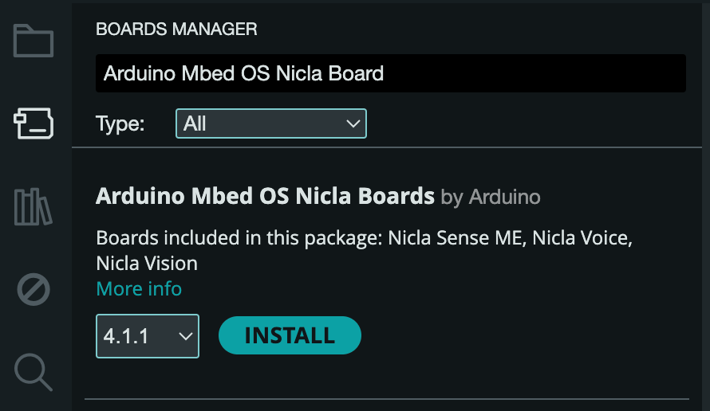

import Tabs from '@theme/Tabs'
import TabItem from '@theme/TabItem'

# ⚙️ Software Configuration

_How to connect your Octopus to Arduino IDE_

---

Depending on your Octopus, there are two different ways to configure Arduino IDE for development (Arduino Nano 33 BLE, and Arduino Nicla Vision). Both cases requires you do download libraries and configuring boards and ports to be able to flash the code needed for the ocotopus.

---

## Download Octopus Firmware

To start programming your octopus, you need to install the Octopus Firmware. 
Go to library manager, and search Octopus: 

Click **Download**. As the Octopus Firmware is dependent on other libraries, you will get a pop up window asking you to download the other packages. Click **Install all**. 

## Add the boards to your Arduino IDE

<Tabs>
  <TabItem value="ble" label="Nano 33 BLE" default>
    To add you board to the Arduino IDE you need to select **Tools menu**, then **Board** and last **Boards Manager**.

    Search for **Arduino Mbed OS Nano Board** and click "install".  

     

    ## Installing Drivers for the Boards

    With the Mbed OS core installed you can procees with the driver installation.

    **Open your fist sketch**

    Open the octopus sample sketch: **File > Examples > Octopus Firmware > octopus_sample**. The sketch will appear in a new window.

    **Select your board type and port**

    You'll need to select the entry in the Tools > Board menu that corresponds to your Arduino board.

    Tools > Board > ArduinoMbed OS Nano Boards > Arduino Nano 33 BLE

  </TabItem>
  <TabItem value="nicla" label="Nicla Vision">
     To add you board to the Arduino IDE you need to select **Tools menu**, then **Board** and last **Boards Manager**.

     Search for **Arduino Mbed OS Nicla Board** and click "install".

     

     To setup the Nicla Vision, have a look at [Flower (Image) Classification](../../run/case3.md) example. 
  </TabItem>
</Tabs>

To choose the serial device corresponding to your board, navigate to the **Tools > Serial Port/Port** menu. If you're unsure which port corresponds to your Arduino board, you can disconnect the board and reopen the menu. The port entry that disappears should be associated with the Arduino board. Reconnect the board and select that serial port from the menu.

