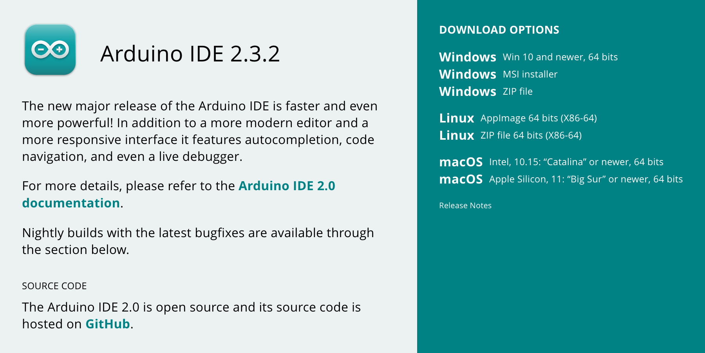
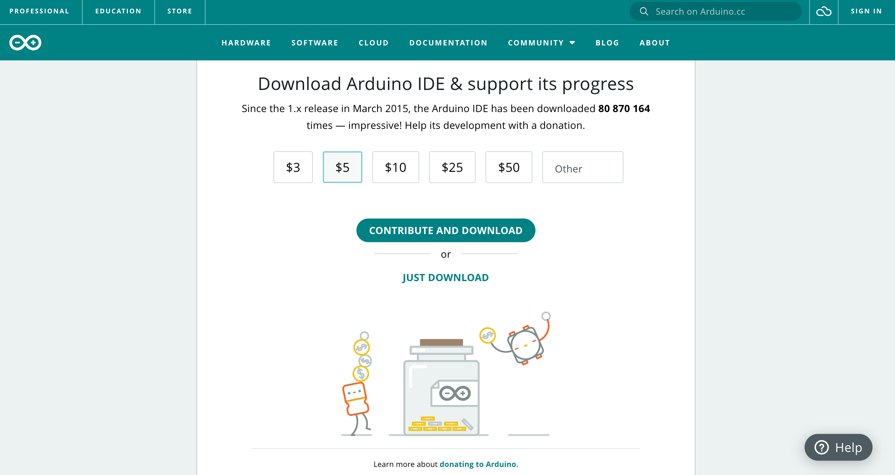
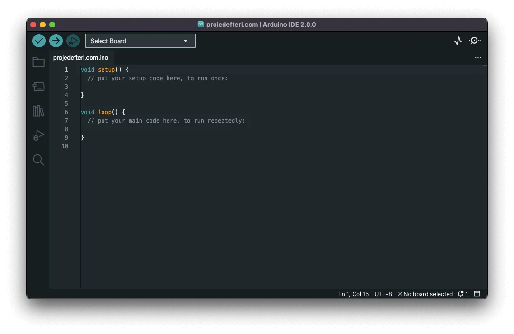

---

sidebar_label: '💿 Software Installation'
sidebar_position: 1
---

# 💿 Software Installation

_Inspired by [Arduino Download IDE]_

---

## Download and install Arduino IDE

First, go to the [software] page on Arduino.cc site. For this section, download the correct version according to you operating system.

After choosing to download the Arduino IDE for your operating system, you'll be presented with a window like the one shown below. From here, simply click on "Just Download" to initiate the download process.

_Note: If you encounter any issues with your operating system version and Arduino IDE downloads, please visit the official Ardunio page: [Arduino Download IDE]._

Once the download and installation process is successfully completed, launch the program. You will encounter a program like the one showed below. Note that the filename and version number of the launched sketch might be different, which is not a problem.

Congratulations! 🎉 You've successfully installed the program. Now you're ready to configure your IDE and start coding! Great job. 😃

---

[Arduino Download IDE]: https://support.arduino.cc/hc/en-us/articles/360019833020-Download-and-install-Arduino-IDE
[software]: https://www.arduino.cc/en/software
