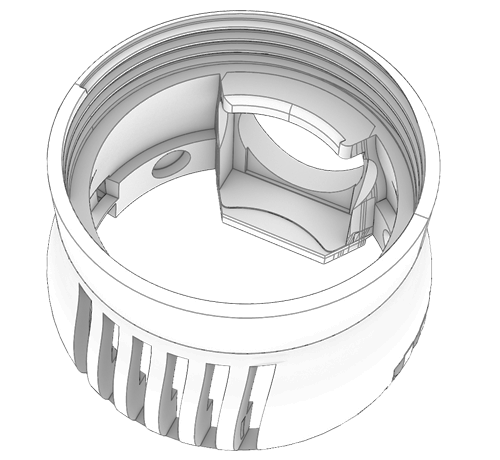
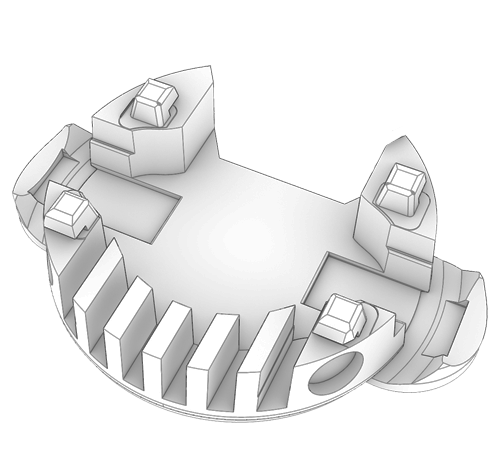
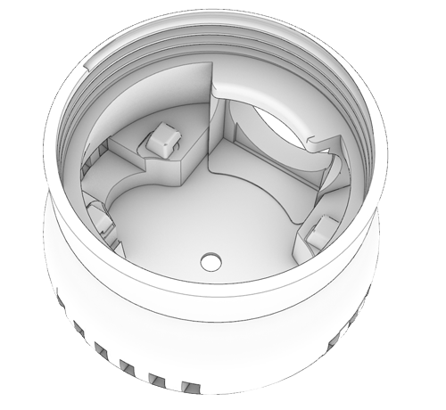
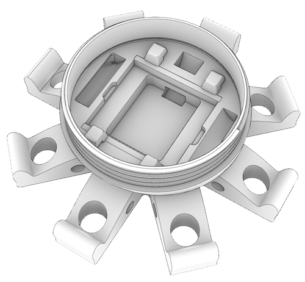
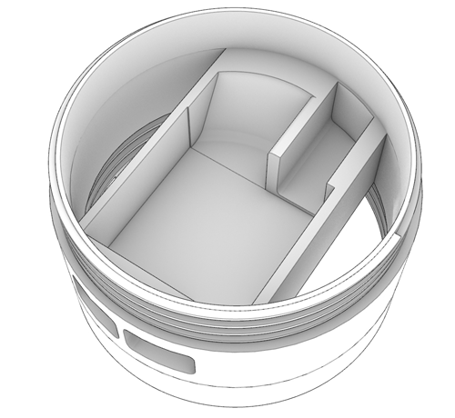
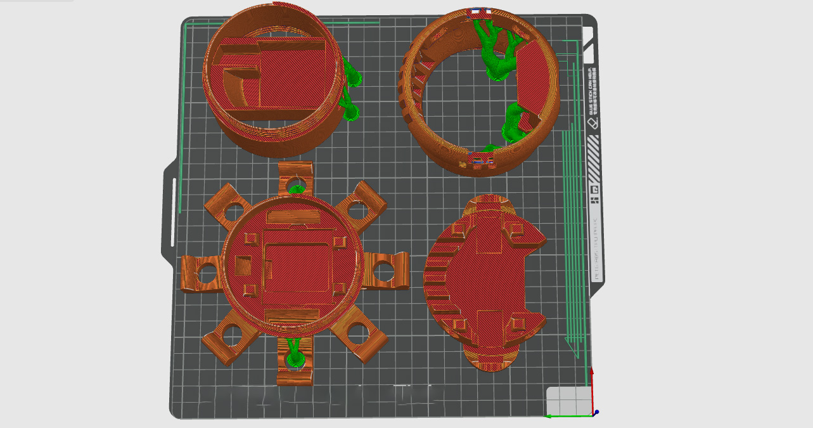

# 🔩 3D Printing

---

## Design Overview

The design consists of only a few modular components, each serving a specific function:

**1. Cap - Nano only:**
- Designed specifically for the **Arduino Nano BLE Sense** configuration.
- Houses the **PCB** and **temperature sensor**.
- Serves as a protective top cover and connects directly to the Nano head.

**2. Head - Nano version:**
- Works in combination with the **Cap**.
- Contains the **cooling fan** to ensure adequate airflow and temperature regulation.
- Provides structural support and interfaces with the middle or bottom layers.

**3. Head - Nicla version:**
- Designed for the **Arduino Nicla**.
- Includes a dedicated **opening for the camera module**.
- Integrates the **cooling fan** and serves as the top housing for this configuration (no cap required).

**4. Middle layer (optional):**
- Designed to house the **Particulate Matter sensor (Sensirion SPS30)**.
- Adds air quality measurement functionality when included.

**5. Bottom layer:**
- Contains the **battery and GPS module**.
- Provides stability and mounting options for securing the device to various surfaces.

## List of Parts

| File Name   | Image       | Supports?   | Printing Time   | Download    |
| ----------- | ----------- | ----------- | --------------- | ----------- |
| *octopus_top_nano.stl*      |      | Needed      |  2h15min           | [Link  ](https://github.com/MIT-Senseable-City-Lab/octopus-fabrication/blob/main/octopus_top_nano.stl)      |
| *octopus_cap_nano.stl*      |      | Optional       |  57m           | [Link  ](https://github.com/MIT-Senseable-City-Lab/octopus-fabrication/blob/main/octopus_cap_nano.stl)      |
| *octopus_top_nicla.stl*      |      | Optional       | 2h           | [Link  ](https://github.com/MIT-Senseable-City-Lab/octopus-fabrication/blob/main/octopus_top_nicla.stl)      |
| *octopus_bottom.stl*   |        | Recommended       | 2h30min          | [Link](https://github.com/MIT-Senseable-City-Lab/octopus-fabrication/blob/main/octopus_bottom.stl)        |
| *octopus_middle.stl **(optional)***  |         | Needed      | Approx. 2h30min           | [Link](https://github.com/MIT-Senseable-City-Lab/octopus-fabrication/blob/main/octopus_middle.stl)        |

## 3D Printing 
### Suggested Settings

:::info

Printing in **white or light colors** is strongly recommended to **minimize heat absorption** and **prevent overheating of internal components**, especially for outdoor or high-temperature environments. 
:::

#### Printer Settings
- **Layer Height:** 0.2 mm (recommended for standard quality) 
- **Wall Thickness:** 1.2 mm
- **Infill Density:** 10%-20% (adjust based on strength requirements)
- **Print Speed:** 50-70 mm/s
- **Support Type:** Tree (auto), with overhang angle set to 30°

### Orientation and Supports

Part orientation has a significant impact on **print quality**, **strength**, and **efficiency**. Components should be positioned to **minimize the use of supports**, which helps reduce print time, conserve material, and maintain clean surface finishes on visible or functional areas.

Whenever possible, **align large flat surfaces parallel to the print bed** and **avoid steep overhangs** by slightly rotating the part or adjusting its position. A well-chosen orientation can **reduce post-processing** and improve overall **dimensional accuracy**.

:::tip

The example below illustrates a print layout that **minimizes support requirements** while maintaining **stability during printing**:

:::

