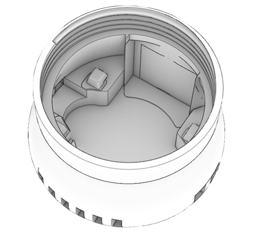
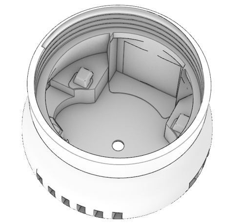

# 🔩 3D Printing

---

## Design Overview

The design consists of three distinct components, each serving specific functions: 

**1. Top layer (head):**
- Houses the PCB (and temperature sensor) and an integrated cooling fan.
- Acts as the top cover for the device, providing access to essential electronic components.
- **Variations:**
     - One variation is tailored for the **Arduino Nano BLE Sense**, and does not include a hole at the top.
     - Another variation accommodates the **Arduino Nicla**, featuring a hole to integrate a camera module.

**2. Bottom layer (legs):** 
- Encases the battery and GPS module.
- Provides the possibility to attach the device to various surfaces.

**3.  Middle layer (optional):** 
- Designed to house the Particulate Matter sensor (Sensirion SPS30).
- Enhances functionality by adding air quality sensing capabilities.

## List of Parts

| File Name   | Image       | Supports?   | Printing Time   | Download    |
| ----------- | ----------- | ----------- | --------------- | ----------- |
| *octopus_top_nano.stl*      |      | Optional       |  2h           | [Link  ](https://github.com/MIT-Senseable-City-Lab/octopus-fabrication/blob/main/octopus_top_nano.stl)      |
| *octopus_top_nicla.stl*      |      | Optional       | 2h           | [Link  ](https://github.com/MIT-Senseable-City-Lab/octopus-fabrication/blob/main/octopus_top_nicla.stl)      |
| *octopus_bottom.stl*   |        | Recommended       | 2h30min          | [Link](https://github.com/MIT-Senseable-City-Lab/octopus-fabrication/blob/main/octopus_bottom.stl)        |
| *octopus_middle.stl **(optional)***  |         | Needed      | Approx. 2h30min           | [Link](https://github.com/MIT-Senseable-City-Lab/octopus-fabrication/blob/main/octopus_middle.stl)        |
| *octopus_top_nano_fan.stl **(optional)***  |         | Recommended      | 2h15min           | [Link](https://github.com/MIT-Senseable-City-Lab/octopus-fabrication/blob/main/octopus_top_nano_fan.stl)        |
| *octopus_top_nicla_fan.stl **(optional)***  |         | Recommended       | 2h10min           | [Link](https://github.com/MIT-Senseable-City-Lab/octopus-fabrication/blob/main/octopus_top_nicla_fan.stl)        |

## 3D Printing 
### Suggested Settings

:::info

Printing in **white or light colors** is strongly recommended to **minimize heat absorption** and **prevent overheating of internal components**, especially for outdoor or high-temperature environments. 
:::

#### Printer Settings
- **Layer Height:** 0.2 mm (recommended for standard quality) 
- **Wall Thickness:** 1.2 mm
- **Infill Density:** 10%-20% (adjust based on strength requirements)
- **Print Speed:** 50-70 mm/s
- **Support Type:** Tree (auto), with overhang angle set to 30°

### Placement

It is generally recommended to place the components in a way that **minimizes supports** to **minimize printing time**  and **maintain the structural integrity of the parts**.

The suggested placement of components on the print bed is as follows: 

