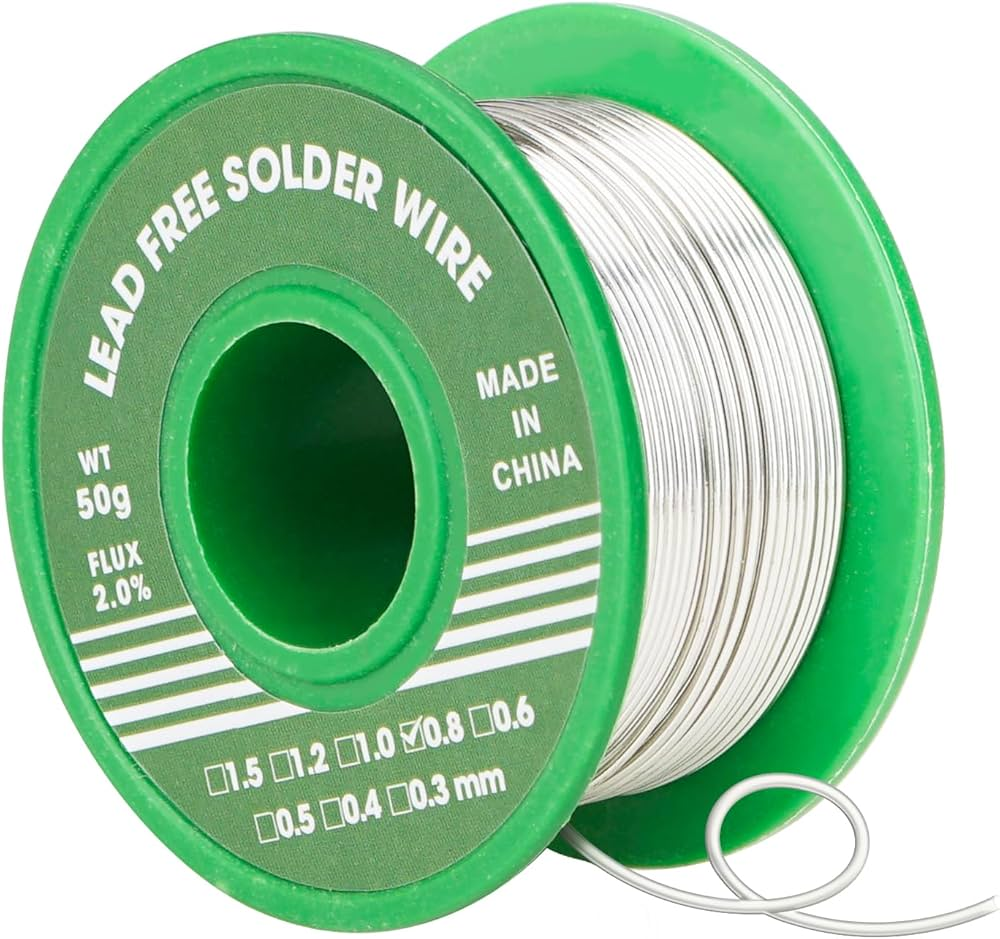
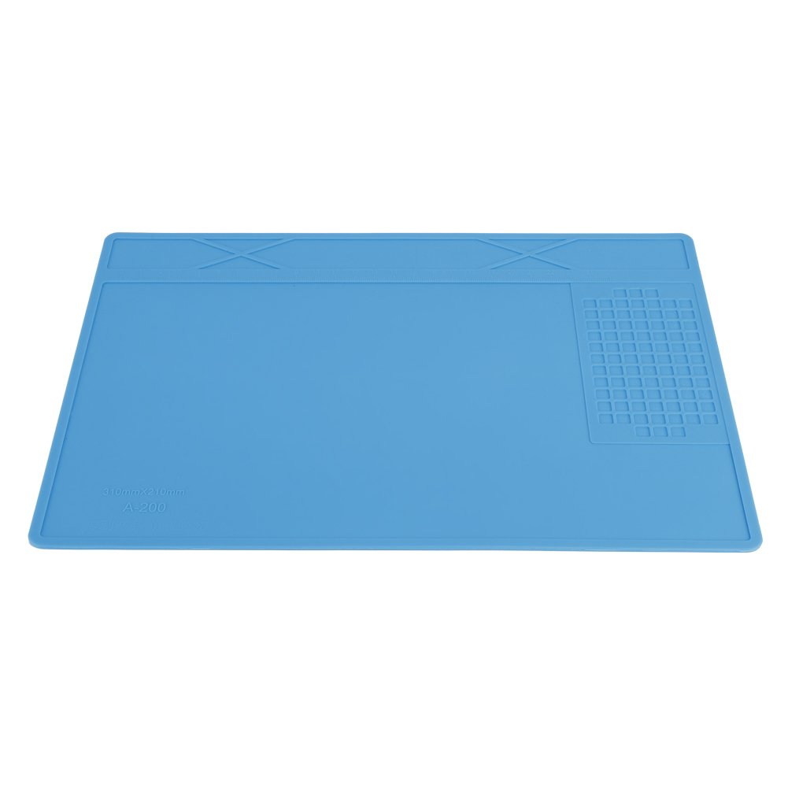

# 🧰 Tools

---

### Bodyframe

| **Tools** | **Image** | **Comment** | **URL**|
|-----------------|-----------------|-----------------|-----------------|
| 3D printer |  | Printing the bodyframe of the Octopus. Multiple printers can be used, but for this example, we use Bambu Lab 3D Printers X1 Series. | [link](https://bambulab.com/en-eu/x1) |

### Soldering (if needed)

If you want to solder all the components on the PCB yourself, you need a soldering iron kit, some tin and a soldering pad. Examples can be found below.

| **Tools** | **Image** | **Comment** | **URL**|
|-----------------|-----------------|-----------------|-----------------|
| Soldering iron kit |  | This is the primary tool used for melting solder. |  [link](https://www.amazon.com/Hakko-FX888D-23BY-Digital-Soldering-Station/dp/B00ANZRT4M/) |
| Soldering tin |  | Soldering tin to place components on the PCB. | [link](https://www.amazon.nl/s?k=soldeertin&crid=WE36WZIBAFQB&sprefix=soldeertin%2Caps%2C125&ref=nb_sb_ss_ts-doa-p_2_10) | 
| Soldering pad |  | A soldering pad is useful to keep track of all the small hardware components while soldering the Octopus PCB. | [link](https://www.amazon.nl/-/en/Soldering-soldering-resistant-magnetic-insulation/dp/B07P11QZ2G) |

