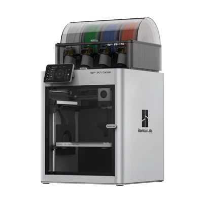

# 🧰 Tools

_Tools needed to assemble the device._

---

### Soldering components (if needed)

If you want to solder all the components on the PCB yourself, you need a soldering iron kit. An example of a kit can be found below.

| **Tools** | **Image** | **Comment** | **URL**|
|-----------------|-----------------|-----------------|-----------------|
| Soldering iron kit |  | This is the primary tool used for melting solder. |  [link](https://www.amazon.com/Hakko-FX888D-23BY-Digital-Soldering-Station/dp/B00ANZRT4M/) |
| 3D printer |  | Printing the bodyframe of the octopus. Multiple printers can be used, but for this example, we use Bambu Lab 3D Printers X1 Series. | [link](https://bambulab.com/en-eu/x1) |

