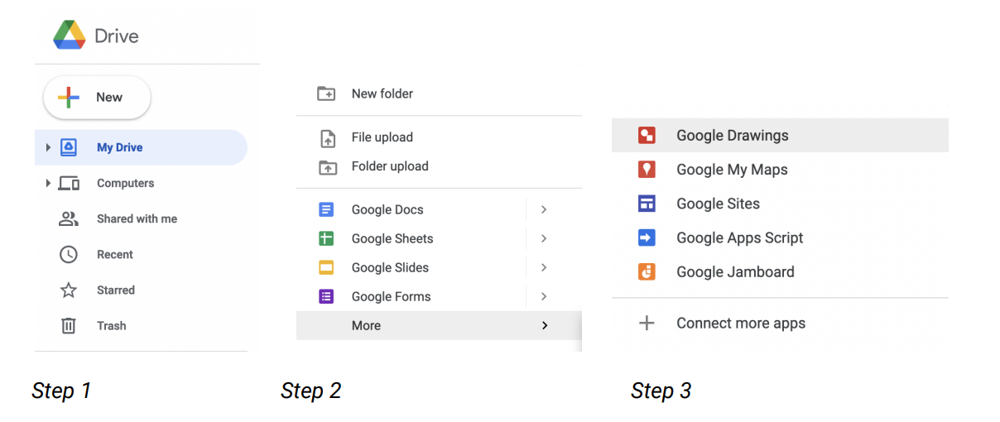
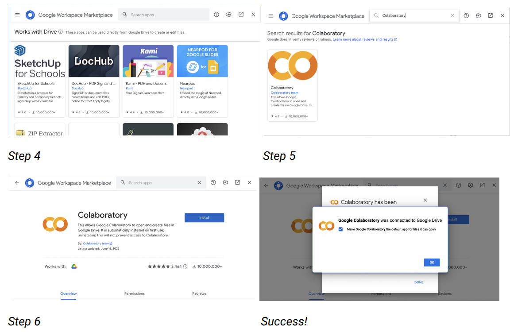

# 🔍 How To's

_General challenges and issues encountered by the octopus community_

---

:::info

This document be extended based on challenges and issues encountered by the octopus community.  

:::

## Google Colaboratory Setup

1. Click the “New” button on the left hand side of the Google drive page.
2. Then scroll down to the “More” option from the popup menu.
3. Next, scroll down to the “Connect More Apps” option on the second pop up menu
and click on it.
4. This should bring up the Google Workspace Marketplace.
5. Use the search bar to search for Colaboratory, and select the option that shows
up.
6. Click the blue “Install” button, give the extension the necessary permissions, and
you should be set up!

---
