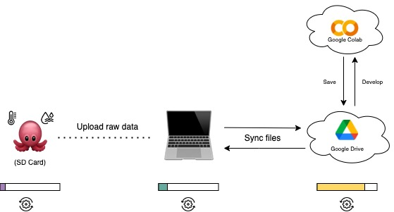
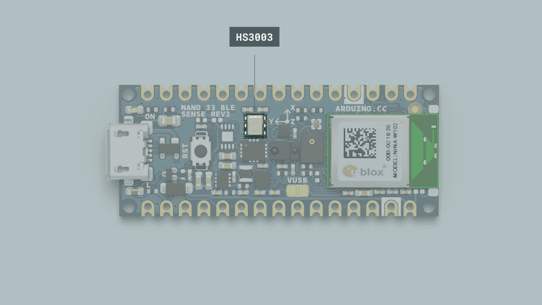

# 🥵 Temperature Exposure

_Beginner-friendly use case with the Octopus

---

## Introduction


In this tutorial, we will go through the requirements of getting started with the Octopus Platform, and collect temperature exposure data.


:::warning

This guide assumes that you already have built an Octopus to monitor temperature and humidity.

:::

## Goals

The goals of these projects are:

 📘 Learn how to use the **Octopus** Library

 🐙 Collect temperature data with the Octopus
 
 🗂️ Upload the data from the Octopus
  
  📈 Process and analyze the collected data

## Hardware and Software needed

The Octopus for temperature exposure consists of these components:

- [Octopus](../category/build)
- [Octopus Arduino Library](../build/firmware/OctopusArduinoLibrary.md)

### Octopus Platform Architecture for Temperature Exposure

Monitoring temperature with the Octopus is a cheap and simple way to use the Octopus. The architecture of the device is shown below.



1. First, the Octopus will log temperature and humidity together with a timestamp to your SD card on the device based on the configuration.
2. Then, you take the SD card and upload the raw data to your computer. Until this step, no processing has happened to the collected data.
3. In the notebook provided, you get to upload your data and visualize it in a graph. To process the data, we use online services from Google (running a notebook in Google Colab to process data, and Google Disk to store the data).

The progress bars below each component indicate how much processing power is used. As you can see, most of the processing power used in this use case is placed in the cloud when you clean and analyze the collected data.

:::info

There are however other ways to do this analysis with the provided notebook; JupyterLab, Kaggle Kernels, Microsoft Azure Notebooks, and more.

:::

## How the sensors work

Before we test our setup, let's have another look at the sensors that come with the Octopus.

### The HS3003 Sensor

 _Image from the official Arduino webpage._

Temperature sensors are devices designed to translate physical temperature into digital data, while humidity sensors detect atmospheric moisture levels and convert them into electrical signals.

The HS3003 stands out as an ultra-compact sensor engineered for measuring relative humidity and temperature. Utilizing the I2C protocol, we will establish communication with the sensor to retrieve data. The sensor encompasses a range of values, including:

_Table 1. Sensor spesification_

| Parameter            | Condition     | Typical   | Range        |
|:---------------------|:--------------|:---------:|:------------:|
| Humidity     | 20 to +80% rH | ± 3.5% rH | 0 to 100 %   |
| Temperature  | 15 to +40 °C  |  ± 0.5 °C | -40 to 120°C |

These sensor types are used more than you would imagine and are found in various everyday objects!

Some of the useful ways they are used are seen in the following applications:

- Air conditioning, heating, and ventilation.
- Air humidifiers.
- Refrigerators.
- Wearable devices.
- Smart home automation.
- Industrial automation.
- Respiratory equipment.
- Asset and goods tracking.

If you want to read more about the HS3003 sensor you can take a look at the [datasheet](https://docs.arduino.cc/resources/datasheets/REN_HS300x-Datasheet_DST.pdf) provided by Arduino.

---

## Programming the board

1.**Octopus Setup**

 Open Arduino IDE, click on **Libraries** tab and search for **Octopus** --> **Examples**, open **octopus_Nano** --> **octopus_sample**.

2.**Connect the board**

 Next, connect the Arduino Nano 33 BLE Sense Rev2 to your computer to verify if the Web Editor recognizes it. If successful, the board and port should be visible as depicted in the image. In case they don't appear, refer to the instructions to install the required plugin enabling the Editor to [detect your board](https://support.arduino.cc/hc/en-us/articles/4406856349970-Select-board-and-port-in-Arduino-IDE).

3.**Test data logging and print sensor values**

 Copy-paste the code below, or find it in *Examples* within the Arduino library. This code will read the sensor values and print them in the Serial Monitor within Arduino IDE through the `Serial.println()` functions. By default, the Octopus will log all data from connected sensors to the SD card as soon as you turn it on.


<details>
   <summary><strong>octopus_sample.ino</strong>: show the whole file</summary>


   ```py title="octopus_sample.ino"
#include "Octopus_Library.h"

unsigned long previousMillis = 0;
const long interval = 5000; // Interval in milliseconds
unsigned long blinkInterval = 100; // Blinking interval in milliseconds
unsigned long lastBlinkMillis = 0;
bool isBlinkOn = false;

// Button state variables
const int buttonPin = 7;  // Pin connected to the button
bool deviceOn = false; // Device state
bool longPressHandled = false; // To ensure long press is handled once
unsigned long buttonPressTime = 0;
const unsigned long longPressDuration = 2000; // Duration to consider as long press (2000ms)

const int RECORDS_PER_FILE = 10;
const int vbatPin = A0;         
const int chargeStatePin = 7;  

const float coldThreshold = 20.0; 
const float hotThreshold = 25.0;  

// Sensor availability flags
bool sps30Available = false;
bool gpsAvailable = false;

void setup() {
    Serial.begin(9600);
    Serial.println("Starting Octopus Device...");

    // Initialize sensors
    Serial.println("Initializing sensors...");
    if (!Octopus::initializeSensors()) {
        Serial.println("Failed to initialize sensors. Continuing...");
    } else {
        Serial.println("Sensors initialized.");
    }
  // Attempt to initialize GPS
    Serial.println("Initializing GPS...");
    gpsAvailable = Octopus::initializeGPS();
    if (!gpsAvailable) {
        Serial.println("GPS not detected.");
    } else {
        Serial.println("GPS initialized.");
    }

    // Attempt to initialize SPS30
    Serial.println("Initializing SPS30...");
    sps30Available = Octopus::initializeSPS30();
    if (!sps30Available) {
        Serial.println("SPS30 not detected.");
    } else {
        Serial.println("SPS30 initialized.");
    }

    // Continue startup even if sensors failed
    Serial.println("Starting data collection...");
    if (!Octopus::start()) {
        Serial.println("Failed to start data collection.");
    } else {
        Serial.println("Data collection started.");
    }
 // Initialize SD card
    Serial.println("Initializing SD card...");
    initSD(RECORDS_PER_FILE);
    Serial.println("SD card initialized.");

    initBatteryMonitoring();

    pinMode(buttonPin, INPUT_PULLUP);
    Serial.println("Setup complete.");
}

void loop() {
    unsigned long currentMillis = millis();

    int buttonState = digitalRead(buttonPin);
    if (buttonState == LOW) {
        if (buttonPressTime == 0) {
            buttonPressTime = millis();
        }

        if ((millis() - buttonPressTime) >= longPressDuration) {
            if (!longPressHandled) {
                deviceOn = false;
                Serial.println("Device turned off");
                setDotStarColor(0, 0, 0);
                if (sps30Available) {
                    Octopus::stopSPS30();
                }
                delay(100);
                longPressHandled = true;
            }
        }
    } else {
        if (buttonPressTime != 0) {
            if (!longPressHandled) {
                deviceOn = true;
                Serial.println("Device turned on");
                initSD(RECORDS_PER_FILE);
                initBatteryMonitoring();
                if (sps30Available) {
                    Octopus::initializeSPS30();
                }
            }
            buttonPressTime = 0;
            longPressHandled = false;
            delay(50);
        }
    }

    if (!deviceOn) {
        delay(100);
        return;
    }

    if (currentMillis - previousMillis >= interval) {
        previousMillis = currentMillis; 

        // Get GPS time if available
        String gpsTime = "N/A";
        if (gpsAvailable) {
            gpsTime = Octopus::getGPSTime();
        }

        // Read GPS data if available
        float latitude = 0, longitude = 0, altitude = 0;
        if (gpsAvailable) {
            if (!Octopus::readGPSData(latitude, longitude, altitude)) {
                Serial.println("Failed to read GPS data");
            }
        }

        // Read other sensor data
        float temperature = Octopus::readTemperature();
        float humidity = Octopus::readHumidity();

        // Read SPS30 data if available
        float pm1_0 = 0, pm2_5 = 0, pm4_0 = 0, pm10_0 = 0;
        if (sps30Available) {
            if (!Octopus::readSPS30Data(pm1_0, pm2_5, pm4_0, pm10_0)) {
                Serial.println("Failed to read SPS30 data");
            }
        }

        // Log the data (Include placeholders or skip the SPS30 values if not available)
        String data = gpsTime + "," + String(latitude, 7) + "," + String(longitude, 7) + "," + temperature + "," + humidity;
        if (sps30Available) {
            data += "," + String(pm1_0) + "," + String(pm2_5) + "," + String(pm4_0) + "," + String(pm10_0);
        } else {
            data += ",N/A,N/A,N/A,N/A";  // Placeholder if SPS30 data is unavailable
        }
        logToSD(data);

        // Print the data to the Serial monitor
        Serial.print("GPS Time: ");
        Serial.println(gpsTime);
        Serial.print("Latitude: ");
        Serial.println(latitude, 7);
        Serial.print("Longitude: ");
        Serial.println(longitude, 7);
      
        // Battery monitoring and RGB LED control
        int vbatRaw = analogRead(vbatPin);
        float vbatVoltage = vbatRaw * (3.294 / 1023.0) * 1.279;
        bool chargeState = digitalRead(chargeStatePin);
        bool batteryConnected = vbatVoltage > 2.5;
        float batteryPercentage = batteryConnected ? calculateBatteryPercentage(vbatVoltage) : 0.0;

        if (temperature < coldThreshold) {
            setDotStarColor(0, 0, 255); 
        } else {
            setDotStarColor(128, 0, 128); 
        }

        if (vbatVoltage < 2.5 || !batteryConnected) {
            if (currentMillis - lastBlinkMillis >= blinkInterval) {
                lastBlinkMillis = currentMillis;
                isBlinkOn = !isBlinkOn;
                if (isBlinkOn) {
                    setDotStarColor(255, 0, 0); 
                } else {
                    setDotStarColor(0, 0, 0);
                }
            }
        }

        Serial.print("VBAT Voltage: ");
        Serial.print(vbatVoltage, 2);
        Serial.print(" V, Charge State: ");
        Serial.print(chargeState ? "Charging" : "Not Charging");
        Serial.print(", Battery Percentage: ");
        Serial.print(batteryPercentage, 1);
        Serial.println(" %");

        Serial.println();
    }

    delay(100);
}
```
</details>


*If needed, more information on how to use the Serial Monitor can be found [here](https://docs.arduino.cc/software/ide-v2/tutorials/ide-v2-serial-monitor/).*

---

## Deployment

When deploying an environmental sensing device outside, there are several factors to consider to ensure accurate and reliable operation. Key factors to consider are:


|**External Factors**: |  |
|--------|---------|
| Temperature Extremes | Ensure the sensor and other electronic components can withstand the local temperature extremes, both hot and cold. |
| Humidity and Moisture | Exposure to rain, fog, or high humidity can damage the sensor and electronics. This is especially critical for sensors not inherently designed to be waterproof. |
|Sunlight and Heat Radiation | Direct sunlight can cause sensors to read higher temperatures due to solar radiation heating the sensor itself (radiative heating).|
| Wind and Air Flow| Adequate airflow around the sensor ensures more accurate temperature readings but can also expose the sensor to more environmental wear and tea.|


| **Physical Casing and Placement** | |
|--------|---------|
| Weatherproof Casing | The Octopus can not handle rain at this stage, so try to limit the amount of heavy rain. |
| Mounting and Placement | Securely mount the casing to avoid physical damage from wind or animals. Placement should be considered to minimize exposure to direct sunlight and maximize exposure to ambient air.|
| Maintenance Accessibility | Design the installation so that the device can be easily accessed for maintenance, calibration, or battery replacement. |

---

## Data analysis with Google Colab

Now that you have the data collected, it's time to analyze it to answer our questions about heat exposure. This guide will provide you with a setup for how to use Google Colaboratory in analyzing your data.

How to set up Google Colaboratory is added in Collaborate - *Data analysis software*: [How to setup Google Colaboratory](../collaborate#data-analysis-software).

Google Colab Notebook for heat exposure data analysis: [Click to Download](../../static/files/notebooks/UseCase1_HeatExposure.ipynb)

---

## Troubleshooting

When developing and adopting sensing technologies, there are a lot of things that might go wrong. Here is a list that includes some of the most common problems:

1. **Incorrect Wiring:** Ensure that the SD card module is wired correctly to the Arduino. Check that the connections are secure and match the pin configurations in your code.
2. **Power Supply Issues:** SD cards can be sensitive to power supply fluctuations. Make sure your Octopus has a stable power source and sufficient current capacity to power both the Arduino Board and the SD card module.
3. **SD Card Formatting:** If the SD card is not properly formatted or formatted with an incompatible file system, it may not work correctly. Ensure the SD card is formatted to FAT16 or FAT32 using a compatible formatting tool.
4. **File System Corruption:** Writing data to the SD card incorrectly or abruptly removing power while writing can lead to file system corruption. This can cause errors when trying to read or write data. Safely eject the SD card before removing it from the Arduino.
5. **File Open/Close Errors:** Make sure you're correctly opening and closing files on the SD card. Failure to close a file properly after writing data can lead to data loss or corruption.
6. **Buffer Overflow:** Writing too much data to the SD card buffer at once can cause buffer overflow errors. Ensure you're writing data in manageable chunks and not overwhelming the buffer.
7. **Hardware Failure:** In rare cases, hardware components such as the SD card module or the Arduino board itself may be defective or damaged, leading to unpredictable behavior. Try swapping out components to isolate and identify any faulty hardware.


## Conclusion

Good work! This guide has shown you how to use the Octopus to monitor heat in a fixed position. By only using the base of the Octopus device, you are able to measure hyperlocal temperature levels! Are you ready for the next challenge? 😉

We encourage you to have a look at the next use cases 2 and 3 with GPS locations, air pollution, and vision-based monitoring to explore new projects with urban sensing.

Please leave a comment in the [GitHub repo](https://github.com/MIT-Senseable-City-Lab/octopus-firmware) if you have any feedback for the Temperature Exposure Use Case 😊

---
