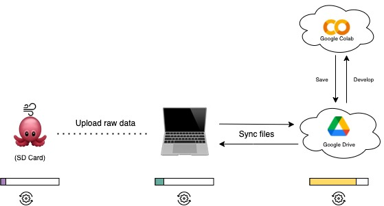
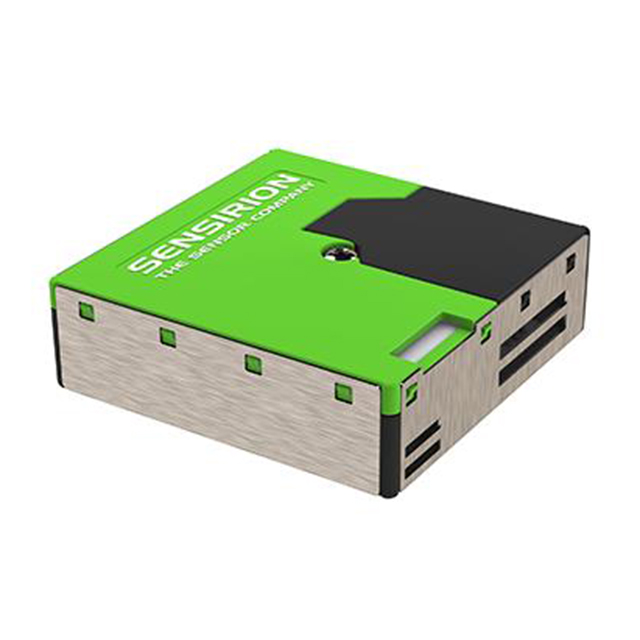
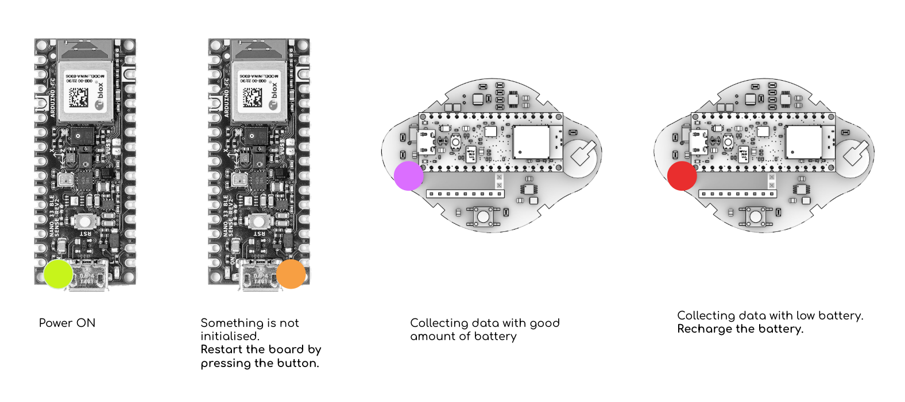

# 🌬️ Air Quality Monitoring 


_Mobile deployment with the Octopus_

---

## Introduction

In this tutorial, we will show how to deploy and adapt a mobile Octopus while collecting air quality data!

:::warning

This guide assumes that you already have built an Octopus to monitor air quality with a GPS connected

:::

## Goals

The goals of these projects are:

  🟩 Use a Sensirion SPS30 PM2.5 Sensor (Air quality sensor)

  🚴 Mobile deployment with the Octopus
  
  🗺️ Displaying collected air quality data on a map

## Hardware and Software needed

This guide assumes that you have assembled an Octopus from this tutorial (add a link to the tutorial).
The octopus for air quality monitoring consists of these components:

- [Octopus](../category/build)
- [Octopus Arduino Library](../build/firmware/OctopusArduinoLibrary.md)

### Octopus Platform Architecture for Heat Exposure

Monitoring heat with the Octopus is a cheap and simple way to use the Octopus. The architecture of the device is shown below.



1. First, the Octopus will log PM2.5 values together with a timestamp to your SD card on the device based on the configuration you choose. 
2. Then, you take the SD card and upload the raw data to your computer. Until this step, no processing has happened to the collected data.
3. In the notebook provided, you get to upload your data and visualize it in a graph. To process the data, we use online services from Google (running a notebook in Google Colab to process data, and Google Disk to store the data). 

 The progress bars below each component indicate how much processing power is used. As you can see, most of the processing power used in this use case is placed in the cloud when you clean and analyze the collected data. 

*Note:* There are however other ways to do this analysis with the provided notebook; JupyterLab, Kaggle Kernels, Microsoft Azure Notebooks, and more. 

## How the sensors work

Before we test our setup, let's have another look at the Sensirion SPS30 PM2.5 Sensor that comes with the Octopus to monitor air quality.

### The Sensirion SPS30 PM2.5 Sensor

Information about the sensor is taken from the official [website of Senserion](https://sensirion.com/products/catalog/SEK-SPS30) and the [datahseets](https://sensirion.com/media/documents/8600FF88/64A3B8D6/Sensirion_PM_Sensors_Datasheet_SPS30.pdf). 

 _Image from the official Sensirion SPS30 Webpage._

The SPS30 particulate matter sensor, certified by MCERTS, uses laser scattering technology for PM monitoring. This sensor is particularly made for detecting PM2.5—tiny particles up to 2.5 microns in diameter that can penetrate deep into the lungs and cause serious health issues like asthma and cardiovascular disease. The SPS30 plays a crucial role in developing new devices for monitoring air quality and preventing pollution-related health problems.

PM4 and PM10 output values are also provided and calculated based on the distribution profile of all measured particles.

Mass concentration precision: 

| Parameter            | Accuracy    | Range        |
|:---------------------|:-------------|:------------:|
| PM1 | ± 5 μg/m3 | 0 to 100 μg/m3 |
| PM2.5 | ± 5 μg/m3 | 0 to 100 μg/m3 |
| PM4 | ±25 μg/m3 | 0 to 100 μg/m3 |
| PM10 | ±25 μg/m3 | 0 to 100 μg/m3 |

If you want to read more about the Sensirion SPS30 PM2.5 Sensor you can take a look at the [datahseets](https://sensirion.com/media/documents/8600FF88/64A3B8D6/Sensirion_PM_Sensors_Datasheet_SPS30.pdf) provided by Senserion.

### GPS-15210


The SparkFun SAM-M8Q GPS Breakout is a high quality GPS board with equally impressive configuration options. The SAM-M8Q is a 72-channel GNSS receiver, meaning it can receive signals from the GPS, GLONASS, and Galileo constellations. This increases precision and decreases lock time and thanks to the onboard rechargable battery, you'll have backup power enabling the GPS to get a hot lock within seconds!


    
---

## Programming the board

1.**Octopus Setup**

Open Arduino IDE, click on **Libraries** tab and search for **Octopus** --> **Examples**, open **Mobile Air Quality Monitoring**.

2.**Connect the board**

Next, connect the Arduino Nano 33 BLE Sense Rev2 to your computer to verify if the Web Editor recognizes it. If successful, the board and port should be visible as depicted in the image. In case they don't appear, refer to the instructions to install the required plugin enabling the Editor to detect your board (link to example in this documentation).

3.**Test data logging and print sensor values**

This code will read the sensor values, and print them in the Serial Monitor within Arduino IDE through the `Serial.println()` functions. 

For this example, we use this setup for the LED colors to communicate the state of the device with the user. Make sure to get familiar with the settings so you can easily modify based on your deployment. 




<details>
   <summary><strong>MobileAirQualityMonitoring.h</strong>: show the whole file</summary>

```py title="MobileAirQualityMonitoring.ino"
#include "Octopus_Firmware.h"
unsigned long previousMillis = 0;
const long interval = 5000; // Interval in milliseconds
unsigned long blinkInterval = 100; // Blinking interval in milliseconds
unsigned long lastBlinkMillis = 0;
bool isBlinkOn = false;

// Button state variables
const int buttonPin = 7;  // Pin connected to the button
bool deviceOn = false; // Device state
bool longPressHandled = false; // To ensure long press is handled once
unsigned long buttonPressTime = 0;
const unsigned long longPressDuration = 2000; // Duration to consider as long press (2000ms)
const int RECORDS_PER_FILE = 100;
const int vbatPin = A0;
const int chargeStatePin = 7;
const float coldThreshold = 20.0;
const float hotThreshold = 25.0;

// Sensor availability flags
bool sps30Available = false;
bool gpsAvailable = false;
int timeOffset = 2; // Change this to 1 for standard time (CET), 2 for daylight saving time (CEST)
void setup() {

    Serial.begin(9600);
    Serial.println("Starting Octopus Device...");

    // Initialize sensors
    Serial.println("Initializing sensors...");
    if (!Octopus::initializeSensors()) {
        Serial.println("Failed to initialize sensors. Continuing...");
    } else {
        Serial.println("Sensors initialized.");
    }

    // Attempt to initialize GPS
    Serial.println("Initializing GPS...");
    gpsAvailable = Octopus::initializeGPS();
    if (!gpsAvailable) {
        Serial.println("GPS not detected.");
    } else {
        Serial.println("GPS initialized.");
    }

    // Attempt to initialize SPS30
    Serial.println("Initializing SPS30...");
    sps30Available = Octopus::initializeSPS30();
    if (!sps30Available) {
        Serial.println("SPS30 not detected.");
    } else {
        Serial.println("SPS30 initialized.");
    }

    // Continue startup even if sensors failed
    Serial.println("Starting data collection...");
    if (!Octopus::start()) {
        Serial.println("Failed to start data collection.");
    } else {
        Serial.println("Data collection started.");
    }

    // Initialize SD card
    Serial.println("Initializing SD card...");
    initSD(RECORDS_PER_FILE);
    Serial.println("SD card initialized.");
    initBatteryMonitoring();
    pinMode(buttonPin, INPUT_PULLUP);
    Serial.println("Setup complete.");
}

String adjustTime(String gpsTime) {
    int hour = gpsTime.substring(0, 2).toInt(); // Extract the hour part
    int minute = gpsTime.substring(3, 5).toInt(); // Extract the minute part
    int second = gpsTime.substring(6, 8).toInt(); // Extract the second part
    hour += timeOffset; // Apply the time offset
    // Handle overflow (e.g., 23 + 2 = 25, so hour should be 1)
    if (hour >= 24) {
        hour -= 24;
    }
    // Format the adjusted time back to a string
    String adjustedTime = (hour < 10 ? "0" : "") + String(hour) + ":";
    adjustedTime += (minute < 10 ? "0" : "") + String(minute) + ":";
    adjustedTime += (second < 10 ? "0" : "") + String(second);
    return adjustedTime;
}

void turnDeviceOn() {
    deviceOn = true;
    Serial.println("Device turned on");
    initSD(RECORDS_PER_FILE);
    initBatteryMonitoring();
    if (sps30Available) {
        Octopus::initializeSPS30();
    }
    setDotStarColor(0, 255, 0); // Indicate the device is on with green
}

void turnDeviceOff() {
    deviceOn = false;
    Serial.println("Device turned off");
    setDotStarColor(0, 0, 0); // Turn off LED
    if (sps30Available) {
        Octopus::stopSPS30();
    }
    delay(100);
}

void handleButtonPress() {
    int buttonState = digitalRead(buttonPin);
    if (buttonState == LOW) {
        if (buttonPressTime == 0) {
            buttonPressTime = millis();
        }
        if ((millis() - buttonPressTime) >= longPressDuration) {
            if (!longPressHandled) {
                turnDeviceOff();
                longPressHandled = true;
            }
        }
    } else {
        if (buttonPressTime != 0 && !longPressHandled) {
            turnDeviceOn();
            buttonPressTime = 0;
            longPressHandled = false;
            delay(50);
        } else {
            buttonPressTime = 0;
            longPressHandled = false;
        }
    }
}

void loop() {
    unsigned long currentMillis = millis();
    handleButtonPress();

    if (!deviceOn) {
        delay(100);
        return;
    }

    if (currentMillis - previousMillis >= interval) {
        previousMillis = currentMillis;
        // Get GPS time if available
        String gpsTime = "N/A";
        if (gpsAvailable) {
            gpsTime = Octopus::getGPSTime();
            gpsTime = adjustTime(gpsTime); // Adjust to local Amsterdam time
        }

        // Read GPS data if available
        float latitude = 0, longitude = 0, altitude = 0;
        if (gpsAvailable) {
            if (!Octopus::readGPSData(latitude, longitude, altitude)) {
                Serial.println("Failed to read GPS data");
            }
        }

        // Read other sensor data
        float temperature = Octopus::readTemperature();
        float humidity = Octopus::readHumidity();

        // Read SPS30 data if available
        float pm1_0 = 0, pm2_5 = 0, pm4_0 = 0, pm10_0 = 0;
        if (sps30Available) {
            if (!Octopus::readSPS30Data(pm1_0, pm2_5, pm4_0, pm10_0)) {
                Serial.println("Failed to read SPS30 data");
            }
        }

        // Log the data (Include placeholders or skip the SPS30 values if not available)
        String data = gpsTime + "," + String(latitude, 7) + "," + String(longitude, 7) + "," + temperature + "," + humidity;
        if (sps30Available) {
            data += "," + String(pm1_0) + "," + String(pm2_5) + "," + String(pm4_0) + "," + String(pm10_0);
        } else {
            data += ",N/A,N/A,N/A,N/A";  // Placeholder if SPS30 data is unavailable
        }
        logToSD(data);

        // Print the data to the Serial monitor
        Serial.print("GPS Time (Amsterdam): ");
        Serial.println(gpsTime);
        Serial.print("Latitude: ");
        Serial.println(latitude, 7);
        Serial.print("Longitude: ");
        Serial.println(longitude, 7);

        // Battery monitoring and RGB LED control
        int vbatRaw = analogRead(vbatPin);
        float vbatVoltage = vbatRaw * (3.294 / 1023.0) * 1.279;
        bool chargeState = digitalRead(chargeStatePin);
        bool batteryConnected = vbatVoltage > 2.5;
        float batteryPercentage = batteryConnected ? calculateBatteryPercentage(vbatVoltage) : 0.0;

        if (temperature < coldThreshold) {
            setDotStarColor(0, 0, 255);
        } else {
            setDotStarColor(128, 0, 128);
        }

        if (vbatVoltage < 2.5 || !batteryConnected) {
            if (currentMillis - lastBlinkMillis >= blinkInterval) {
                lastBlinkMillis = currentMillis;
                isBlinkOn = !isBlinkOn;
                if (isBlinkOn) {
                    setDotStarColor(255, 0, 0);
                } else {
                    setDotStarColor(0, 0, 0);
                }
            }
        }
        Serial.print("VBAT Voltage: ");
        Serial.print(vbatVoltage, 2);
        Serial.print(" V, Charge State: ");
        Serial.print(chargeState ? "Charging" : "Not Charging");
        Serial.print(", Battery Percentage: ");
        Serial.print(batteryPercentage, 1);
        Serial.println(" %");
        Serial.println();
    }
    delay(100);
}
```

</details>

---

## Deployment

When deploying an environmental sensing device outside, there are several factors to consider to ensure accurate and reliable operation. Key factors to consider are: 

|**External Factors**: |  |
|---------|----------|
| Temperature Extremes | Ensure the sensor and other electronic components can withstand the local temperature extremes, both hot and cold. |
| Humidity and Moisture | Exposure to rain, fog, or high humidity can damage the sensor and electronics. This is especially critical for sensors not inherently designed to be waterproof. |
|Sunlight and Heat Radiation | Direct sunlight can cause sensors to read higher temperatures due to solar radiation heating the sensor itself (radiative heating).|
| Wind and Air Flow| Adequate airflow around the sensor ensures more accurate temperature readings but can also expose the sensor to more environmental wear and tea.| 

| **Physical Casing and Placement** | |
|---------|----------|
| Weatherproof Casing | Even though the Octopus can handle some rain, try to limit the amount of heavy rain. |
| Mounting and Placement | Securely mount the casing to avoid physical damage from wind or animals. Placement should be considered to minimize exposure to direct sunlight and maximize exposure to ambient air.|
| Maintenance Accessibility | Design the installation so that the device can be easily accessed for maintenance, calibration, or battery replacement. |

---

## Data analysis with Google Colab

Now that you have the data collected, it's time to analyze it to answer our questions about air quality monitoring. This guide will provide you with a setup for how to use Google Colaboratory in analyzing your data. 

How to set up Google Colaboratory is added in Collaborate - *Data analysis software*: [How to setup Google Colaboratory](../collaborate#data-analysis-software).

Google Colab Notebook for temperature exposure data analysis: [Click to Download](../../static/files/notebooks/UseCase2_AirQuality.ipynb)

---

## Troubleshooting

When developing and adopting sensing technologies, there are a lot of things that might go wrong. Here is a list that includes some of the most common problems: 

1. **Incorrect Wiring:** Ensure that the SD card module is wired correctly to the Arduino. Check that the connections are secure and match the pin configurations in your code.
2. **Power Supply Issues:** SD cards can be sensitive to power supply fluctuations. Make sure your Octopus has a stable power source and sufficient current capacity to power both the Arduino Board and the SD card module.
3. **SD Card Formatting:** If the SD card is not properly formatted or formatted with an incompatible file system, it may not work correctly. Ensure the SD card is formatted to FAT16 or FAT32 using a compatible formatting tool.
4. **File System Corruption:** Writing data to the SD card incorrectly or abruptly removing power while writing can lead to file system corruption. This can cause errors when trying to read or write data. Safely eject the SD card before removing it from the Arduino.
5. **File Open/Close Errors:** Make sure you're correctly opening and closing files on the SD card. Failure to close a file properly after writing data can lead to data loss or corruption.
6. **Buffer Overflow:** Writing too much data to the SD card buffer at once can cause buffer overflow errors. Ensure you're writing data in manageable chunks and not overwhelming the buffer.
7. **Hardware Failure:** In rare cases, hardware components such as the SD card module or the Arduino board itself may be defective or damaged, leading to unpredictable behavior. Try swapping out components to isolate and identify any faulty hardware.


## Conclusion

Good work! This guide has shown you how to use the Octopus to monitor air quality with a mobile deployment. By only using the base of the Octopus device, you are able to measure hyperlocal air quality levels! Are you ready for the next challenge? 😉

We encourage you to have a look at the next use cases 3 to explore new projects with urban sensing and the use of EdgeAI. 

Please leave a comment in the [GitHub repo](https://github.com/MIT-Senseable-City-Lab/octopus-firmware) if you have any feedback for Use Case 2 😊

---


