# 💐 Flower (Image) Classification

_Computer Vision Classification with the Octopus_

---

*Guide inspired by [TinyML made easy](https://mjrovai.github.io/TinyML_Made_Easy_NiclaV_eBook/)*

## Introduction

In this tutorial we will show how to deploy an octopus that can utilize the power of EdgeAI technologies and run classification models to detect its surroundings! This example gives you an introduction to how to set up software, collect data, train your model, and deploy on the octopus platform. The classification model of flowers can be changes to any kind type of classification or object detection you want! Use the guide as an example to build you own octopus detection model. 

:::warning

This guide assumes that you already have built an octopus with a nicla vision board fir image classification.

:::

## Goals

The goals for this project are:

  👀 Getting Started with Octopus Nicla Vision

  🗂️ Collecting data with OpenMV IDE

  ☑️ Building your own classification model

  💐 Deploying your classification model with Octopus

## Hardware and Software needed

This guide assumes that you have assembled an octopus with a Nicla Vision.
The octopus for image classification consists of these components:

- [Octopus](../category/build)
- [Arduino IDE](../build/firmware/Softwareinstallation.md)
- Octopus Library installed
- Account in [Edge Impulse](https://edgeimpulse.com/)
- OpenMV IDE (for data collection to train your model)

### Octopus Platform Architecture for Image Classification

Running a classification model on the Nicla Vision creates a whole new architecture for the Octopus. Instead of collecting raw data from the sensors, and uploading the data to google drive and analysing ing google colaboratory, the Arduino Nicla runs a TinyML model on the device itself, and reacts on the environment by changing color. 

In this case, the Octopus change color if it sees a spesific flower (Daisy or Hydrangeas), or none. 

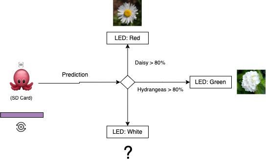

1. The Nicla Vision takes a photo
2. By running a TinyML on the device, it classifies if the octopus sees a Daisy, Hydrangeas, or only background. 
3. If one of the flowers has a predicted value more than 80%, the Octopus LED will change color. If not, it will be white. 

_Note: these values are easily changed in the code if you want to modify the colors!_

## How the sensors work

Before we test our setup, let's have another look at the Arduino Nicla Vision board to make you familiar with the concepts. 

The [Arduino Nicla Vision](https://docs.arduino.cc/hardware/nicla-vision/) is a development board equipped with dual processors (M7 and M4) that facilitate simultaneous execution of tasks. It is part of a specialized series of boards, each designed for distinct functions, like the [Nicla Sense ME](https://www.bosch-sensortec.com/software-tools/tools/arduino-nicla-sense-me/) and [Nicla Voice](https://store-usa.arduino.cc/products/nicla-voice?_gl=1*l3abc6*_ga*MTQ3NzE4Mjk4Mi4xNjQwMDIwOTk5*_ga_NEXN8H46L5*MTY5NjM0Mzk1My4xMDIuMS4xNjk2MzQ0MjQ1LjAuMC4w), all sharing the same form factor. For instance, one processor on the Nicla Vision can perform real-time computer vision tasks, while the other handles essential functions such as motor control and communication, serving also as a user interface. Additionally, the board includes an onboard wireless module that enables concurrent management of WiFi and Bluetooth Low Energy (BLE) connectivity.


### Nicla Vision Hardware

1. **Two paralell Cores**

The primary processor in the board is the dual-core [STM32H747](https://content.arduino.cc/assets/Arduino-Portenta-H7_Datasheet_stm32h747xi.pdf?_gl=1*6quciu*_ga*MTQ3NzE4Mjk4Mi4xNjQwMDIwOTk5*_ga_NEXN8H46L5*MTY0NzQ0NTg1My4xMS4xLjE2NDc0NDYzMzkuMA..), which comprises a Cortex® M7 running at 480 MHz and a Cortex® M4 at 240 MHz. These two cores interact using a Remote Procedure Call (RPC) mechanism, enabling smooth function calls between the processors. They also share access to all on-chip peripherals. The processing capabilities allow for running various programming frameworks and environments:

Arduino sketches on top of the Arm® Mbed™ OS
Native Mbed™ applications
MicroPython or JavaScript through an interpreter
TensorFlow™ Lite models for machine learning applications


2. **Memory**

Memory plays a pivotal role in embedded machine learning projects. The Nicla Vision board includes up to 16 MB of QSPI Flash for storage purposes. However, it's important to note that machine learning inferences primarily utilize the MCU's SRAM. The STM32H747, which is shared by both processors, offers only 1MB of SRAM. Additionally, this MCU comes with 2MB of FLASH memory, which is mainly used for storing code.


3. **Sensors**

- **Camera**: The Nicla Vision is equipped with a GC2145 2 MP Color CMOS Camera, providing high-quality image capture capabilities.

- **Microphone**: It features the MP34DT05, an ultra-compact, low-power, omnidirectional digital MEMS microphone. This microphone incorporates a capacitive sensing element and an IC interface, optimized for clarity and performance.

- **6-Axis IMU**: For motion sensing, the board includes the LSM6DSOX 6-axis IMU, which gathers data from a 3D gyroscope and a 3D accelerometer, offering comprehensive spatial orientation insights.

- **Time of Flight Sensor**: The VL53L1CBV0FY Time-of-Flight (ToF) sensor enhances the Nicla Vision with precise and energy-efficient ranging capabilities. This sensor utilizes an invisible near-infrared VCSEL laser, including the analog driver, all housed within a compact module situated beneath the camera.

    
---

## Introduction


As we delve into the realm of embedded machine learning, also known as tinyML, the profound influence of Computer Vision (CV) and Artificial Intelligence (AI) on modern technology becomes clear. These fields are revolutionizing how machines interact with the world, enabling advancements in autonomous vehicles, robotics, healthcare, and surveillance. At the forefront of this AI revolution is Edge AI, identified by Gartner as having significant impact potential, marking a pivotal moment in technology.

Central to Edge AI is Edge Computer Vision, with Image Classification often serving as the introductory use case in Machine Learning (ML) applications. In this tutorial, we will undertake a computer vision project that employs Convolutional Neural Networks (CNNs) for real-time image classification. Utilizing TensorFlow, a leading framework in the AI community, we will adapt a pre-trained MobileNet model for edge deployment. Our focus will be on fine-tuning the model to perform efficiently on the Arduino Nicla Vision board, a platform known for its resource constraints.

Throughout this exercise, we will apply techniques such as quantization and pruning to minimize computational demands while maintaining high accuracy. By the end of this guide, you will have a functional prototype capable of real-time image classification on a low-power embedded system, showcasing the practical applications of tinyML in action.

---

## Computer Vision

Computer vision fundamentally seeks to empower machines with the ability to interpret and act upon visual data, essentially replicating the capabilities of the human visual system. In contrast, Artificial Intelligence (AI) is a wider field that includes machine learning, natural language processing, robotics, and more. Integrating AI algorithms with computer vision projects significantly enhances the system's ability to comprehend, interpret, and respond to visual information.

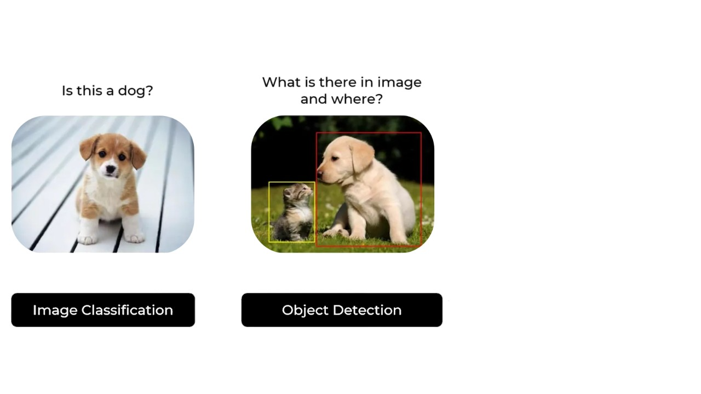

In the context of embedded devices, computer vision primarily focuses on applications such as Image Classification and Object Detection. These technologies are not only pivotal but also adaptable to compact devices like the Arduino Nicla Vision, making them suitable for real-world applications. In this chapter, our discussion will center on Image Classification, exploring how it can be effectively implemented on small-scale devices to perform robust visual tasks.

---

## image Classification Project Goal

The first step in any ML project is to define the goal. In this case, it is to detect and classify two specific flowers present in one image with a white background. 


For this example, we will use two white flowers we found at our lab: white daisy, and white hydrangeas. We will also make sure to collect images of a white background with no flowers. 

---

## Data Collection with OpenMV IDE

After setting a clear goal for your Machine Learning project, the next critical step involves collecting your dataset. This can be accomplished using several tools depending on your setup and requirements. For capturing images, you might consider options like the Edge Impulse Studio, the OpenMV IDE we've installed, or even your smartphone. In this guide we will show how to use the OpenMV IDE to gather the necessary image data for our project.

First, create in your computer a folder where your data will be saved. For thie example, lets call the folcer "flowers". Next, on the OpenMV IDE, go to `Tools > Dataset Editor` and select `New Dataset` to define the dataset collection:

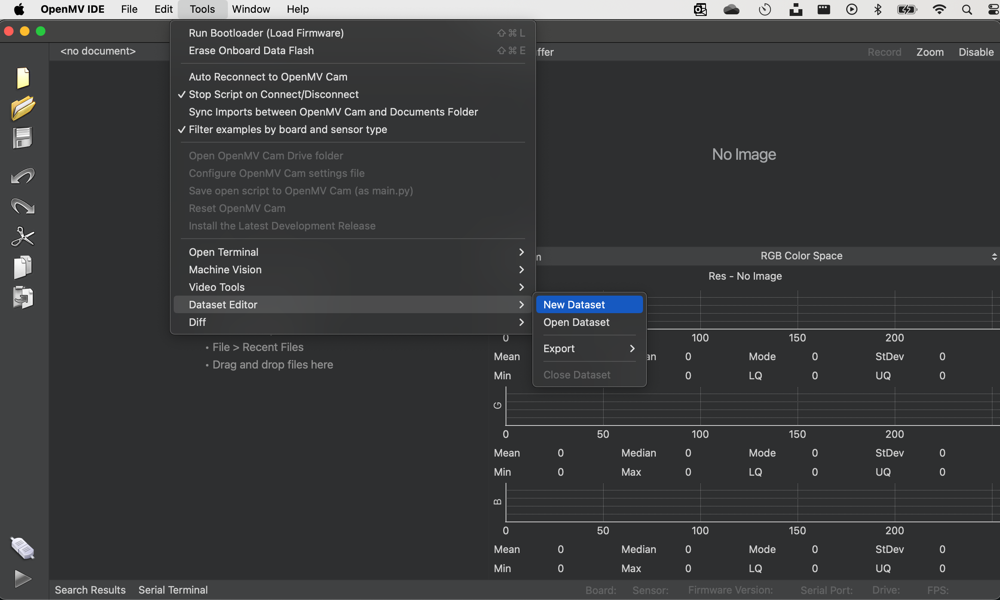

Once you begin using the IDE for data collection, it will prompt you to specify where your data should be stored. You'll need to navigate to and select the "flowers" folder that was previously created. After doing so, you'll notice new icons appearing on the left panel of the IDE, indicating that your data capture setup is ready to proceed.


To start categorizing your data, click on the upper icon (1) and enter the name for your first class. For instance, you could label it "white_daisy." This step will allow you to begin organizing your dataset by specific categories directly within the IDE.

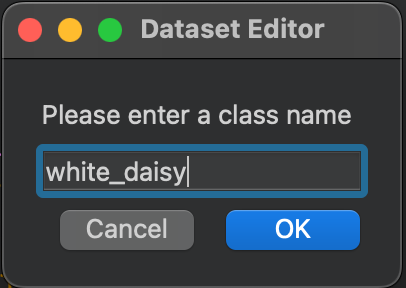

Running the `dataset_capture_script.py` and clicking on the camera icon (2), will start capturing images, placing them in the selected folder:


Repeat with the other classes, in this case "white_hydrangeas" and "background": 

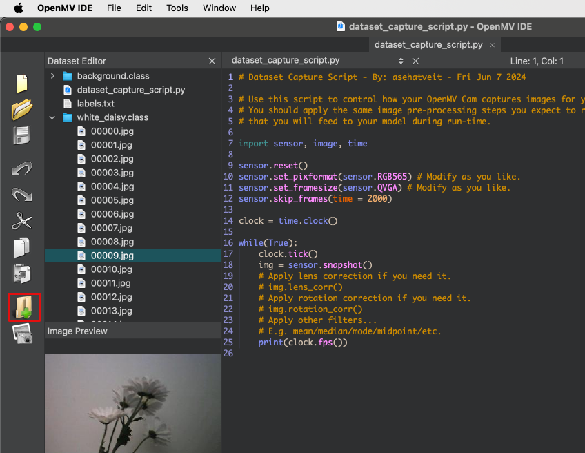

:::tip

We recommend collecting approximately 70 images for each category to ensure a more robust dataset. Aim to include a variety of angles, backgrounds, and lighting conditions to enhance the model's ability to generalize from the data. 

:::


The images are captured in QVGA frame size, which is 320x240, and utilize the RGB565 color pixel format. Once you have completed capturing your dataset, you can close the `Dataset Editor Tool` by navigating to `Tools > Dataset Editor`. At the end of this process, your dataset on your computer will include three distinct classes: "white_daisy," "white_hydrangeas," and "background."

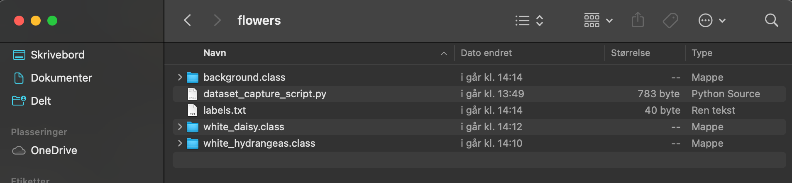


Once your dataset is ready, you should proceed to the Edge Impulse Studio and upload the dataset to your project. This step integrates your newly collected data into the machine learning workflow, enabling you to begin model training and testing.

---

## Training the model with Edge Impulse Studio

Next, we'll use the Edge Impulse Studio for training our model. Start by entering your account credentials, then create a new project within the platform.

:::tip

Here, you can clone a similar project: [NICLA-Vision_Image_Classification](https://studio.edgeimpulse.com/public/273858/latest).

:::

### Dataset

Using the Edge Impulse Studio (or Studio), we'll follow four key steps to prepare our model for deployment on the Nicla Vision board: Dataset, Impulse, Tests, and Deploy (specifically targeting the Edge Device, in this instance, the Nicla Vision).


First, concerning the Dataset, it's important to note that our original dataset, which was captured using the OpenMV IDE, will be segmented into Training, Validation, and Test subsets. The Test Set will be separated early on and reserved exclusively for the testing phase post-training. The Validation Set, on the other hand, will be utilized during the training process.


In the Studio, navigate to the 'Data acquisition' tab. Under the 'UPLOAD DATA' section: 

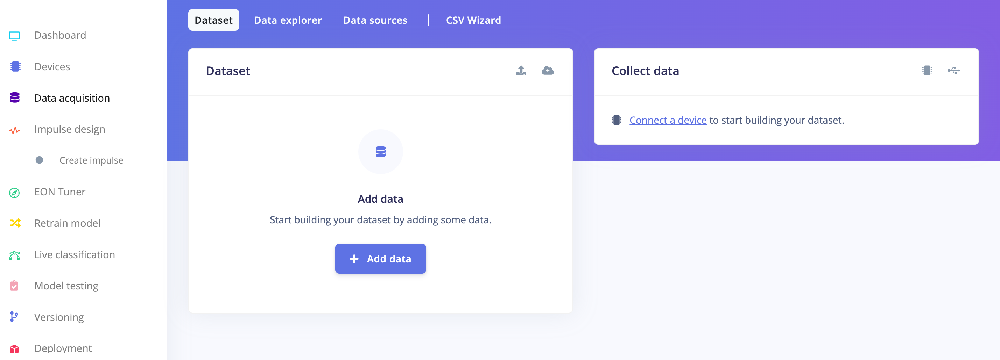

Upload the files for the chosen categories from your computer. The Studio will handle the division of the original dataset into training and test sets. When uploading, specify the label for the specific data. In this case, we uploaded the folder with pictures of white_daisy:

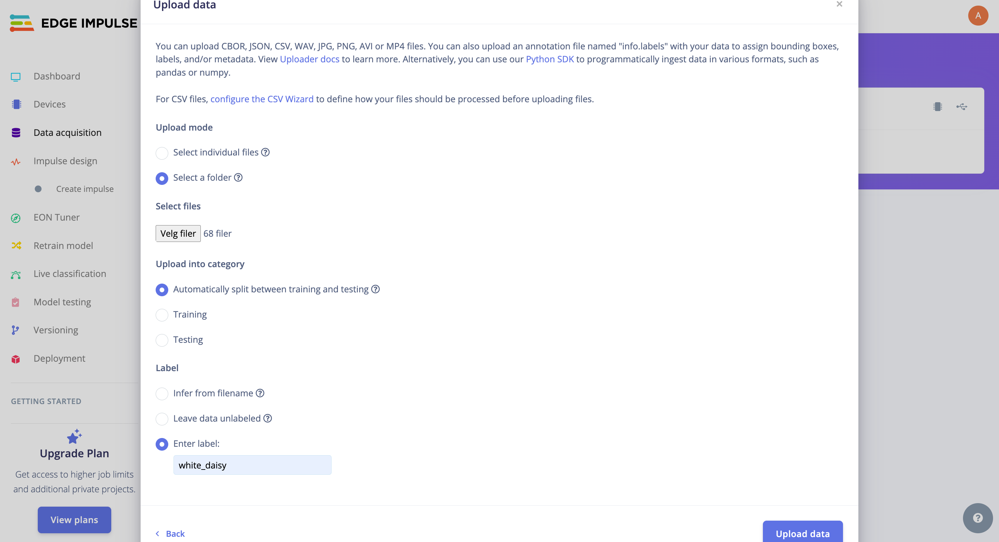


Continue this process for all three classes. Once complete, you should be able to view your "raw data" in the Studio:

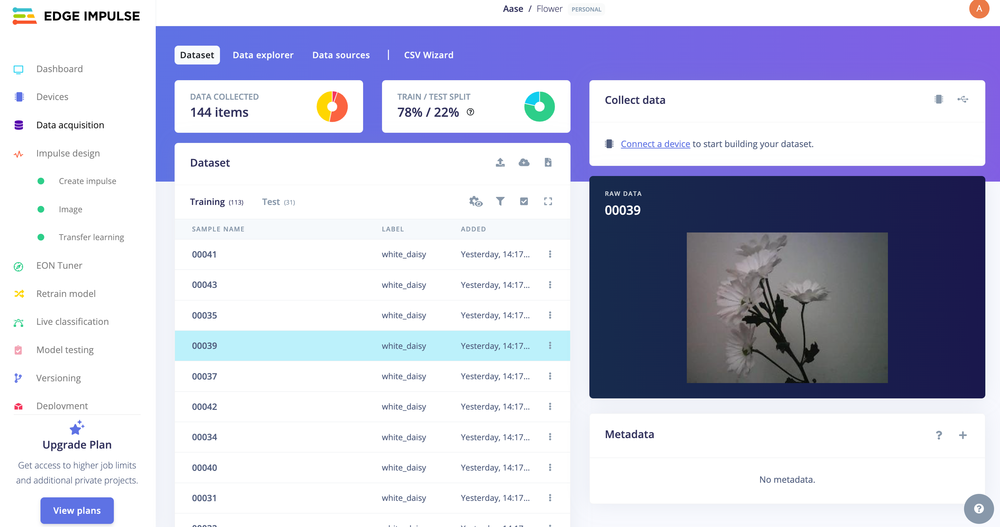


The Studio provides tools to explore and manage your data effectively. It offers a view of all project data, allowing you to delete, inspect, or re-label individual data items as needed. In this simple project setup, the data should appear correctly organized and ready for the next steps.

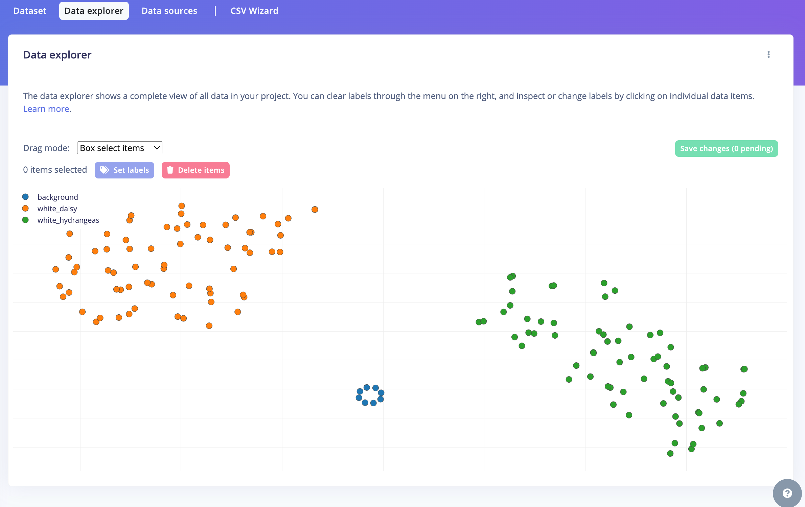

*Note:* In the example above, you can see that the 'background' images are only a few. This is because we only added 7 images of a white background for the model. In your case, try to add more pictures, maybe with different lights and shadows on the background to make the model more robust. 


### The Impulse Design

In this phase of our project, we need to focus on two critical aspects:

1. Data Pre-processing: This involves resizing the individual images to a consistent size and deciding on the `color depth` whether to use RGB or Grayscale. These adjustments ensure that our data is in the proper format for the model training process.

2. Specify a Model, in this case, it will be the `Transfer Learning (Images)` to fine-tune a pre-trained MobileNet V2 image classification model on our data. This method performs well even with relatively small image datasets (around 150 images in our case).


Transfer Learning with MobileNet simplifies the model training process, making it ideal for projects with limited resources or data. MobileNet, a lightweight pre-trained model, has already learned important features from a large dataset called ImageNet.


By using these pre-existing features, you can train a new model for your specific needs with less data and computing power, achieving good accuracy more efficiently. This approach is particularly useful when resources are tight but you still need effective AI capabilities.


This method greatly cuts down on training time and computational expense, making it perfect for fast prototyping and deployment in embedded devices where efficiency is crucial.

Navigate to the Impulse Design Tab to set up your impulse. Define the image size as 96x96, formatting them into a squared shape without cropping (squash). Choose the Image and Transfer Learning blocks, then save your impulse configuration.

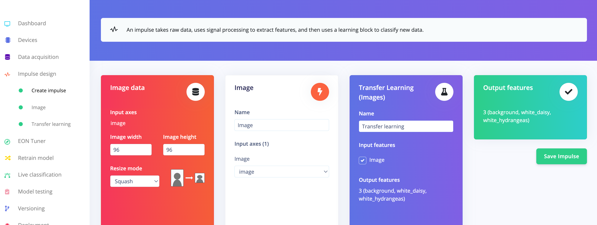

### Image pre-processing

All the input QVGA/RGB565 images will be converted to 27,640 features (96x96x3).

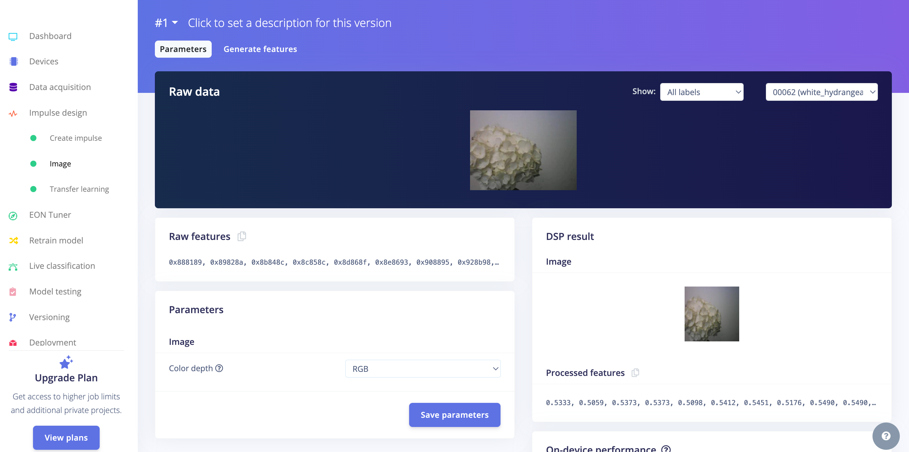

Press [Save parameters] and Generate all features:

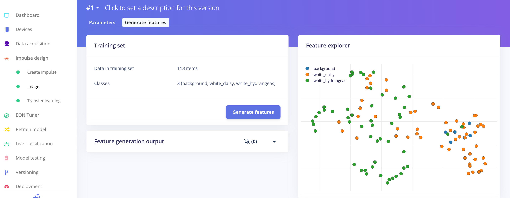


### Model Design

In 2007, Google launched MobileNetV1, a series of neural networks optimized for mobile devices, supporting tasks like classification and detection. These models are designed to be small, low-latency, and energy-efficient. In 2018, Google introduced MobileNetV2, which brought advancements such as Inverted Residual Blocks and Linear Bottlenecks, improving performance by capturing more complex features with fewer parameters and improving computational efficiency and accuracy.

MobileNetV1 and V2 both uses depthwise separable convolutions to lower computational costs, but V2 additionally uses a non-linear activation in the expansion layer and retains a linear activation in the bottleneck layer to preserve crucial data. MobileNetV2's architecture is particularly optimized for higher accuracy and efficiency.

To adapt MobileNets for even more specific or constrained use cases, they include a 'width multiplier' parameter (α), which adjusts the network's size and computational load. Edge Impulse Studio supports both MobileNet versions, allowing image inputs of different sizes and various α values to balance accuracy against memory use and latency. For instance, using MobileNetV2 with 160x160 images and α=1.0 maximizes accuracy but requires more resources, while MobileNetV1 with α=0.10 minimizes resource usage.


For this project, we'll employ **MobileNetV2 with a configuration of 96x96 images and a width multiplier of 0.1** (MobileNetV2 96x96 0.1), requiring approximately 265.3 KB of RAM. This model is well-suited for the Nicla Vision board, which has 1MB of SRAM. 

Navigate to the Transfer Learning Tab, press "Choose a different model" and select this specific model configuration: 

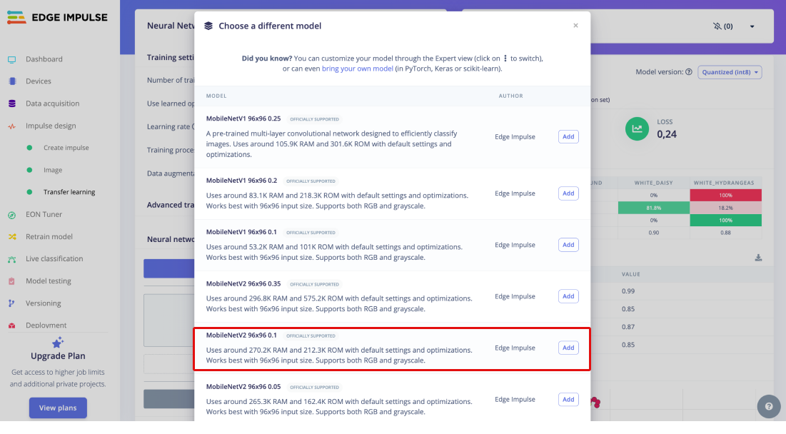

---

## Model Training

Another important technique in deep learning is Data Augmentation. This method improved machine learning model accuracy by generating additional synthetic data. During training, the data augmentation system applies small, random modifications to your training data, such as flipping, cropping, or rotating images.

To see how this is implemented, let’s explore how Edge Impulse applies a data augmentation policy to your data:

```python
# Implements the data augmentation policy
def augment_image(image, label):
    # Flips the image randomly
    image = tf.image.random_flip_left_right(image)

    # Increase the image size, then randomly crop it down to
    # the original dimensions
    resize_factor = random.uniform(1, 1.2)
    new_height = math.floor(resize_factor * INPUT_SHAPE[0])
    new_width = math.floor(resize_factor * INPUT_SHAPE[1])
    image = tf.image.resize_with_crop_or_pad(image, new_height, new_width)
    image = tf.image.random_crop(image, size=INPUT_SHAPE)

    # Vary the brightness of the image
    image = tf.image.random_brightness(image, max_delta=0.2)

    return image, label
```

Exposing your model to these variations during training helps prevent it from "memorizing" superficial details in the training data. This approach encourages the model to learn the deeper, underlying patterns in the dataset, potentially improving its ability to generalize to new data.

Here is the Training result:

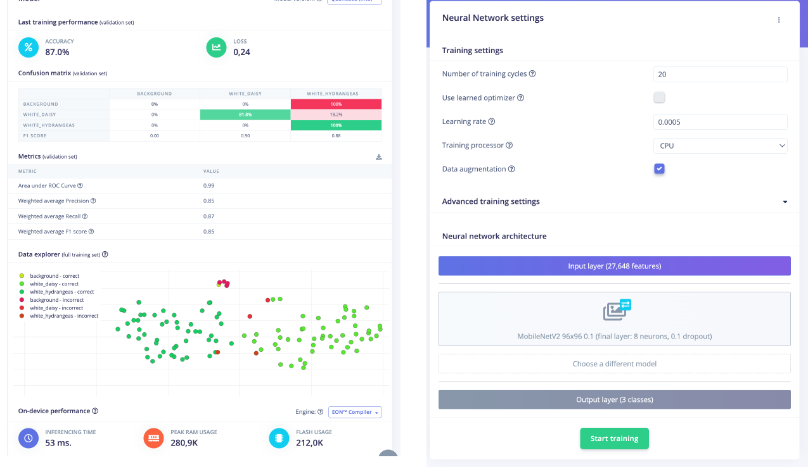

The result is pretty good with 53ms of latency. However, the confusion matric shows a bias in the dataset where background failed the test, indicating a dataset that is not balanced and robust enough (as mentioned above). Even if the background is classified wrong, we see the values of the flower F1 scores (statistical measure used to evaluate the accuracy of a classification model - the harmonic mean of precision and recall) are good. 

---

## Model Testing


Now, you should take the data set aside at the start of the project and run the trained model using it as input. The result again shows an error in the dataset where the background-images are not classified correctly, and some uncertain values for white_hydrangeas.

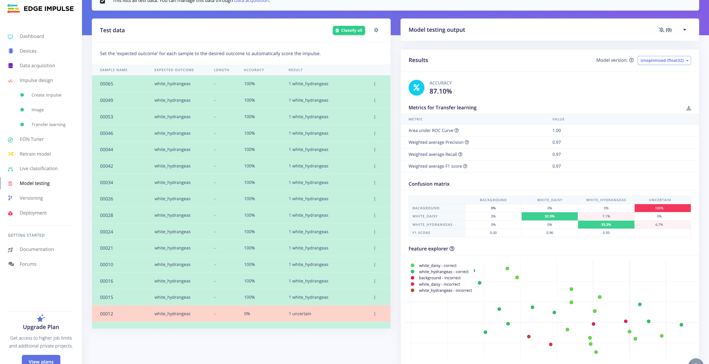

However, we decide to move on and test our model in the real world!

---

## Deploying the model in Arduino IDE

Finally we are here, and we can deploy our model on the Octopus! 

EdgeImpulse provides two different ways to deploy the trained model on the Nicla Vision Board: as a library, or as a firmware. In this example, we deploy it as an Arduino Library. 

1. Move to the "Deployment" page
2. Search for "Arduino Library"
3. Make sure the deployment is for `Arduino Nicla Vision`
4. Push `Build`

Then, on your computer you will have the Arduino Library! 

5. Upload the library, and run the cketch `nicla_vision_camera.ino` available in Examples undert the library name. 

### Changing the Octopus LED based on classification results

To have the octopus respond with LED colors to the classified values from the model running on yout octopus, therea re a few changes that needs to be done with the file `nicla_vision_camera.ino`. 

First, in the `loop()`, before printing the predicted values to the Serial Monitor, add the code below: 
```python
if (result.classification[1].value > 0.8) {
    ei_printf("green\n");
    setRGBColor(0, 255, 0);
    delay(1000);
  }
  
  if (result.classification[2].value > 0.8) 
  {
    ei_printf("red\n");
    setRGBColor(255, 0, 0);
    delay(1000);
  }
```


In the end of your file, add the function `setRGBColor()`: 

```python
/**
 * @brief   Set the RGB color
 *
 * @param[in]  red     Red component (0-255)
 * @param[in]  green   Green component (0-255)
 * @param[in]  blue    Blue component (0-255)
 */
void setRGBColor(uint8_t red, uint8_t green, uint8_t blue) {
    for (int i = 0; i < NUMPIXELS; i++) {
        strip.setPixelColor(i, strip.Color(red, green, blue));
    }
    strip.show();
}
```

Now, try to compile and run the code, and see the values change based on the classifications!

---

## Deployment

When deploying an environmental sensing device outside, there are several factors to consider to ensure accurate and reliable operation. Key factors to consider are: 

|**External Factors**: |  |
|---------|----------|
| Temperature Extremes | Ensure the sensor and other electronic components can withstand the local temperature extremes, both hot and cold. |
| Humidity and Moisture | Exposure to rain, fog, or high humidity can damage the sensor and electronics. This is especially critical for sensors not inherently designed to be waterproof. |
|Sunlight and Heat Radiation | Direct sunlight can cause sensors to read higher temperatures due to solar radiation heating the sensor itself (radiative heating).|
| Wind and Air Flow| Adequate airflow around the sensor ensures more accurate temperature readings but can also expose the sensor to more environmental wear and tea.| 

| **Physical Casing and Placement** | |
|---------|----------|
| Weatherproof Casing | Even though the octopus can handle some rain, try to limit the amount of heavy rain. |
| Mounting and Placement | Securely mount the casing to avoid physical damage from wind or animals. Placement should be considered to minimize exposure to direct sunlight and maximize exposure to ambient air.|
| Maintenance Accessibility | Design the installation so that the device can be easily accessed for maintenance, calibration, or battery replacement. |

---

## Troubleshooting

When developing and adopting sensing technologies, there is a lot of things that might go wrong. Here is a list that includes some of the most common problems: 

1. **Incorrect Wiring:** Ensure that the SD card module is wired correctly to the Arduino. Check that the connections are secure and match the pin configurations in your code.
2. **Power Supply Issues:** SD cards can be sensitive to power supply fluctuations. Make sure your Octopus has a stable power source and sufficient current capacity to power both the Arduino Board and the SD card module.
3. **SD Card Formatting:** If the SD card is not properly formatted or formatted with an incompatible file system, it may not work correctly. Ensure the SD card is formatted to FAT16 or FAT32 using a compatible formatting tool.
4. **File System Corruption:** Writing data to the SD card incorrectly or abruptly removing power while writing can lead to file system corruption. This can cause errors when trying to read or write data. Safely eject the SD card before removing it from the Arduino.
5. **File Open/Close Errors:** Make sure you're correctly opening and closing files on the SD card. Failure to close a file properly after writing data can lead to data loss or corruption.
6. **Buffer Overflow:** Writing too much data to the SD card buffer at once can cause buffer overflow errors. Ensure you're writing data in manageable chunks and not overwhelming the buffer.
7. **Hardware Failure:** In rare cases, hardware components such as the SD card module or the Arduino board itself may be defective or damaged, leading to unpredictable behavior. Try swapping out components to isolate and identify any faulty hardware.

:::tip

It is very common to have problems with the USB connection, but dont worry. There are a lot of online forums that can help you troubleshoot your problem, have a look at for example the [Arduino Forum](https://forum.arduino.cc/c/using-arduino/6). 

:::

## Conclusion


Good work! This guide has shown you how to use the octopus to build an image classification model to classify flowers in your environment. By utilizing the opportunities of EdgeAI technologies, your small Octopus is able to classify flowers and change colors based on what it "sees"! 😉

Please leave a comment in the GitHub repo if you have any feedback for Use Case 3 😊

---


---
